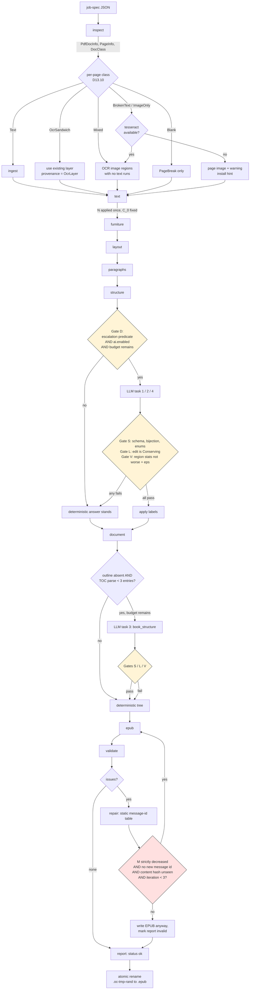

# OpenConvert — The Conversion Pipeline

**Status:** Final for v1 build-out. Companion to `docs/ARCHITECTURE.md`; governed by `docs/DECISIONS.md` (ADR v2) and `docs/IR_SKETCH.md`.
**Date:** 2026-09-09
**Scope:** the twelve stages, what each one does, what evidence it acts on, what it is allowed to remove, and what must be true when it ends. Component boundaries, crate rules, IPC and the conservation law's formal statement live in `ARCHITECTURE.md`.
**Convention:** numbers marked `(provisional)` are `source = provisional` entries in `thresholds.toml` — unanchored, owner-assigned, `review_by`-dated (D17). Citations use `R2 §B.4`, `R10 §6.7`, `RT C1`, `D13.10`.

---

## 0. How to read this document

### 0.1 The stage set

The twelve stage names are also the `--dump-stage` names and the `stage{name}` values on the IPC event stream (`ARCHITECTURE.md` §8.2):

```
inspect · ingest · text · furniture · layout · paragraphs · structure · document · epub · validate · repair · report
```

Stages run sequentially. Parallelism is *inside* a stage (`rayon` per page in `ingest` and image decoding), never across stages, because the conservation check after each stage needs one well-defined state to compare against (D13.11).

### 0.2 Stage kinds and the ledger reason set

Every stage declares `kind` and a closed `reasons` set at compile time; the checker verifies that what the stage actually did matches what it declared (I-2).

| Stage | Kind | Declared reasons |
|---|---|---|
| `inspect` | Conserving | — (read-only; no IR text exists yet) |
| `ingest` | **Budgeted** | `GeneratedSpace`, `ClippedOffPage`, `HiddenText`, `OverdrawDedup`, `OcrLayerDuplicate`, `Ocr` |
| `text` | **Budgeted** | `SoftHyphen`, `LigatureExpand` |
| `furniture` | **Budgeted** | `RunningHeader`, `RunningFooter`, `PageNumber`, `Watermark`, `DecorativeGlyph` |
| `layout` | Conserving | — |
| `paragraphs` | **Budgeted** | `Dehyphenate` |
| `structure` | Conserving | — |
| `document` | Conserving | — |
| `epub` | Conserving | — |
| `validate` | Conserving | — (read-only) |
| `repair` | Conserving | `UserOverride` only |
| `report` | Conserving | — (read-only) |

Three amendments to `IR_SKETCH.md` are applied throughout this document, resolving notes N-1 … N-3 of `ARCHITECTURE.md`:

- **N-1 — I-6 amended.** `reason = Ocr` is permitted on **any page region whose bbox contains no PDF text runs**, not only on wholly text-free pages. On an `image-only` page that is the whole page; on a `mixed` page it is each image region not covered by text. Every region carrying an `Ocr` entry is marked `provenance = ocr` and excluded from the source-retention metric. This is what makes D13.10's `mixed`-page routing legal.
- **N-2 — `Ocr` is owned by `ingest`.** OCR runs inside `ingest`, after page classification, when an engine is available. `ingest`'s declared reason set includes `Ocr`.
- **N-3 — `HiddenText` added to the closed `Reason` enum.** `ClippedOffPage` now means *geometrically* absent: outside the CropBox, or removed by a clipping path. `HiddenText` means *rendered but not visible*: render mode 3 on a page that is **not** an OCR sandwich, or a fill colour within the ΔE tolerance of the local background (white-on-white). Both are owned by `ingest`. Adding a `Reason` variant is an `ir_version` question; the amendment lands with `ir_version = 1` before first release.

### 0.3 What runs after every stage

Independently of the stage's own checks, `oc-core` runs the conservation battery (`ARCHITECTURE.md` §5) at every stage boundary: **I-1** (ledger-balanced conservation), **I-2** (declared reasons), **I-3** (conserving stages have empty ledgers), **I-4** (per-reason budgets), **I-5** (dehyphenation is the only in-word edit), **I-6** (OCR is Added-only in text-free regions). **I-7** is the end-to-end form and is a release gate. Results land in `Ledger::per_stage_checks` and in the report.

One sequencing detail matters. `C_raw` is fixed at the end of extraction inside `ingest`; `C_0` — the retention denominator — is only complete after `N` has run in `text`. Budgets are fractions of `|C_0|`, so **`ingest`'s budget checks (I-4) are deferred to the `text` stage boundary**, where `C_0` first exists. I-1, I-2 and I-6 are checked at the `ingest` boundary as normal.

### 0.4 Where the LLM may act

Two stages, four tasks, `ai.enabled = false` by default (D17). `structure` hosts tasks 1 (`metadata`), 2 (`heading_roles`) and 4 (`verse_quote`); `document` hosts task 3 (`book_structure`). **No other stage may call a model, and no task is ever invoked per page.**

Budget, resolving N-4: **≤ 8 calls per book total**, with task 4 batched at **10 blocks per call**, so `llm.max_blocks_per_book = 30` costs at most 3 calls and leaves 5 for tasks 1–3 including `book_structure` chunking above 200 headings. When the cap would be exceeded, tasks are dropped in a fixed order — `verse_quote` first, then extra `book_structure` chunks, then `heading_roles`, never `metadata`. `llm.max_wallclock_share = 0.25` is a hard stop computed against **total** wall-clock including the LLM: a 300-page book at the 0.5 s/page budget *(provisional)* is ~150 s deterministic, so the LLM budget is ≤ 50 s (resolution N-5; D9's G4 is tightened accordingly for the reference 300-page book on machine L).

### 0.5 Presets

Resolving N-6: a preset is a **partial override map over `thresholds.toml` keys by name**, so precedence applies key-by-key — `CLI > job-spec > user config > preset > defaults`. A preset that sets `paragraphs.unwrap_factor` overrides that key and nothing else; every other key still resolves from `thresholds.toml` with its own provenance intact. Preset overlays live inside `thresholds.toml` (`[preset.poetry.paragraphs.unwrap_factor]`) so the `source`/`owner`/`review_by` rules apply uniformly to every number in the system.

---

## 1. Overall flow



Two loops and one branch are load-bearing. The **confidence branch** (`Gate D`) is evaluated *before* any call, so a book whose predicates never fire costs zero LLM seconds. The **gate cluster** (`S`, `L`, `V`) runs after every call and its failure edge always lands on the deterministic answer — the LLM is never on the critical path for producing a valid EPUB. The **validate→repair loop** has a strictly decreasing lexicographic measure, so its cap of 3 is a safety bound and not the termination argument.

---

## 2. `inspect`

**Purpose.** Answer "what kind of PDF is this?" before committing to a conversion. Backs `openconvert inspect`, the GUI pre-flight, and the automatic preset choice. This stage is cheap enough to run on a whole shelf of books.

**Inputs.** File path, optional password. **Outputs.** `PdfDocInfo` (pages, producer, creator, encrypted, outline, xmp, info_dict, has_struct_tree, producer_family), `Vec<PageInfo>` (media_box, crop_box, rotate, class, class_conf, image_area_ratio, visible_chars, invisible_chars), `DocClass`, `PresetName`.

**Stage kind.** Conserving. No IR text exists yet, so the ledger is empty by construction.

**Algorithm.**

1. Open with an empty user password; on failure, prompt or take `--password`. Owner-password permission flags do **not** block conversion; the flags are recorded in the report (D13.11).
2. Probe the PDFium ABI version against the expected pin. Runtime binding via `libloading` means a mismatch is a runtime error rather than a link error, so it must be caught at startup (D3, RT B1).
3. `lopdf` object access: `/Producer` and `/Creator` → `ProducerFamily` ∈ {PdfTeX, InDesign, Word, Ghostscript, Scanner, Typst, WeasyPrint, Chromium, Unknown}; `/Metadata` XMP; `/StructTreeRoot` presence → `has_struct_tree`.
4. Outline via PDFium bookmarks, cross-checked against `lopdf`'s object walk (belt and braces — a truncated bookmark chain reads as an empty outline in one API and a partial one in the other).
5. **Fix the geometry space here, once.** MediaBox, CropBox, `/UserUnit` and page `/Rotate` collapse into one normalized space: origin top-left, y down, PDF points, after rotation and CropBox offset. This is an asserted invariant, not a convention, because mixing CropBox and image space silently deleted body text in a shipping 2026 tool (R1 §D.6 #1, D13.3).
6. Cheap per-page probe without full glyph extraction: counts of visible vs render-mode-3 characters, image area ratio, and whether any font name matches the `GlyphLess`/`GlyphLessFont` family used by OCR sandwich producers.

**Per-page classification and routing (D13.10).** The verdict is first-class and user-overridable, not an implicit branch. Four artefacts wear the name "PDF" — born-digital clean, born-digital broken-encoding, scan with OCR layer, pure scan — and a converter that does not classify first will do the wrong thing on three of the four (R1 §D.3).

| Class | Rule *(all thresholds provisional)* | Routing in `ingest` |
|---|---|---|
| `Blank` | `visible_chars == 0` and `image_area_ratio < 0.01` | emit a `PageBreak` only |
| `ImageOnly` | `visible_chars < 10` and `image_area_ratio ≥ 0.5` | OCR the whole page if an engine exists; else page image + warning |
| `OcrSandwich` | render-mode-3 chars > 0.9 × total chars and `image_area_ratio ≥ 0.5`; strengthened by a `GlyphLessFont` name | use the existing layer, `provenance = OcrLayer`, low confidence; offer re-OCR |
| `BrokenText` | U+FFFD/PUA share above the language prior **or** dictionary hit rate below it | OCR if available; else page image + warning |
| `Mixed` | `visible_chars ≥ 10` and `image_area_ratio ≥ 0.25` | OCR **only** image regions whose bbox contains no text runs (N-1) |
| `Text` | otherwise | normal extraction |

The `BrokenText` rule is a substitution: `has_unicode_map_error()` could not be found in `pdfium-render` (V2 §1, RT B1), so the detector falls back to the U+FFFD/PUA share plus the dictionary hit rate — both of which R10 §4.4 already lists as valid signals. The substitution is recorded as a decision in the report.

**Document classification** — `book-prose`, `academic-multicolumn`, `scanned`, `slides/other` — comes from the page-class histogram, a column-count estimate on a sampled 10 pages, and the page aspect ratio. It plus the producer family selects the preset when `preset = "auto"`. Producer-specific parameter rules are kept to a short, explicit table rather than a general dispatch mechanism, because input-dependent behaviour complicates testing (R1 §D.6 #4, D13.10).

**Confidence signals.** `class_conf` is the margin between the winning rule and its runner-up. **Escalation predicate:** none. `inspect` never calls a model.

**LLM.** None.

**Validation at end of stage.** Page count ≤ `limits.max_pages`; every page's normalized rect lies inside its CropBox plus tolerance; `has_struct_tree` recorded as a *hint only* — 12.6 % of real PDFs are tagged, the share is declining since 2019, and 74.9 % meet none of six accessibility criteria, so tagging is never a pipeline branch (R1 §A.10, §D.2).

**Failure modes and fallbacks.** Encrypted with an unknown password → exit 1 with a named warning and no partial output. Corrupt cross-reference table → PDFium's own repair path, recorded as a decision. Degenerate page count → the `max_pages` limit fires cleanly rather than allocating.

**Complexity / perf.** No glyph extraction, so a 300-page book inspects in tens of milliseconds. Target: `openconvert inspect` under 1 s on any book.

---

## 3. `ingest`

**Purpose.** Turn the PDF into glyphs, images, vector regions and — where routing demands it — OCR runs, all in the one normalized space. Establish `C_raw`.

**Inputs.** `PdfDocInfo`, `Vec<PageInfo>`, the `PdfBackend`. **Outputs.** `Vec<Glyph>` per page, the `FontInfo` table, `Vec<ImageRef>`, `Vec<VectorRegion>`, OCR-derived `Run`s where applicable, and `Ledger.c_raw`.

**Stage kind.** **Budgeted** — `GeneratedSpace`, `ClippedOffPage`, `HiddenText`, `OverdrawDedup`, `OcrLayerDuplicate`, `Ocr` (N-2, N-3).

**Algorithm.**

*Character extraction.* Per-character access through the verified `pdfium-render` API surface: `tight_bounds()`, `loose_bounds()`, `origin()`, `matrix()`, `angle_degrees()`, `unscaled_font_size()` / `scaled_font_size()`, `font_name()`, `font_weight()`, `font_is_italic()`, `render_mode()`, `fill_color()`, `is_generated()`, `is_hyphen()` (D3). Each becomes a `Glyph` with both bounding boxes, the origin, the font id, size, weight, italic flag, render mode, fill colour, and the generated/hyphen flags.

*Four removal classes, each with its own reason.*

- **`GeneratedSpace`** — PDFium synthesizes spaces that were never in the content stream, and they pollute every geometry-based heuristic downstream (R2 §D.5 #6). They are dropped and recorded. Because they are whitespace, they lie outside `C` by construction, so the ledger entry is bookkeeping and I-1 is unaffected — this is precisely why the conservation law restricts itself to non-whitespace scalars.
- **`ClippedOffPage`** — the glyph bbox lies wholly outside the CropBox, or is wholly removed by the active clipping path. Text drawn but clipped away (an overflowing table cell, a masked draft watermark) extracts cleanly and was never visible (R1 §A.7.4).
- **`HiddenText`** — render mode 3 on a page **not** classified `OcrSandwich` (a redaction artefact, template cruft, keyword stuffing), or a fill colour within the ΔE tolerance of the local background. Hidden text appears in extraction but not in rendering (R1 §A.7.5).
- **`OverdrawDedup`** — identical strings whose bounding boxes overlap by more than 90 %. This is fake bold drawn twice, and it is a *distinct* defect class from OCR sandwiching with a different fix: bbox-overlap dedup rather than a render-mode check (R1 §A.7.3, §D.6 #2). Budget ≤ 0.02 of `|C_0|` *(provisional)*.
- **`OcrLayerDuplicate`** — a file OCR'd twice accumulates two invisible layers. The surviving layer is kept with `provenance = OcrLayer`; the duplicate is removed. Budget ≤ 0.60 **per page** *(provisional)*, because on a scanned page the duplicate genuinely is half the characters.

Both dedup classes are folded into `C_0` rather than charged against `C_raw`, so deleting a duplicate copy of a page cannot inflate the retention ratio (RT C1).

*Images.* Each `ImageRef` carries intrinsic pixels, the SMask flag, colour space and **effective DPI** = intrinsic pixels ÷ (bbox size in points ÷ 72). The stored size is not the rendered size — extracting an XObject naively gives a 4000 px image placed in a 200 px box, or a 50 px image stretched full width (R1 §A.6). Handling:

- **SMask composite.** Transparency lives in a *separate* image; extracting the base alone yields a black background, extracting naively also emits the mask as a spurious second image. Base and `/SMask` are composited to RGBA. Stencil `/ImageMask` bitmaps take the fill colour from the graphics state.
- **Tiling stitch.** Producers split one logical image into horizontal strips or a tile grid to bound memory; naive extraction emits 40 slivers per figure, which is a confirmed live defect in a modern tool (Marker #1092). Adjacent XObjects whose placement rectangles tile a contiguous region at matching resolution are stitched before emission.
- **Ornament drop.** A small image identical (by content hash) across ≥ 30 % of pages is a rule, logo or ornament — dropped (D13.11).
- **Background / watermark drop.** A full-page image covering ≥ 95 % of the page with text drawn over it is a background — dropped, or the EPUB balloons to hundreds of megabytes.
- **Inline images** (`BI`/`ID`/`EI`) are in the content stream, not the `/XObject` resources, and are missed entirely by extractors that only walk resources. They are collected explicitly.
- CMYK → sRGB is naïve in v1 and flagged in the report; the inverted-CMYK-JPEG (APP14) trap is detected and recorded.

*Vector regions.* Long, thin, axis-aligned paths become `VectorRegion { is_rule: true }` — these feed the footnote separator detector and the table lattice detector. Other vector clusters are rasterized at 2× in v1; SVG is a post-v1 extension point.

*OCR (N-1, N-2).* After classification, when an engine is available:

| Page class | OCR action | Ledger |
|---|---|---|
| `ImageOnly` | render at 300 dpi, OCR the whole page | `Ocr`, Added-only |
| `BrokenText` | render at 300 dpi, OCR the whole page; the broken text layer is removed under `HiddenText` if invisible, else kept and flagged | `Ocr` + possibly `HiddenText` |
| `Mixed` | OCR **only** image regions whose bbox contains no text runs; insert as blocks positioned by bbox | `Ocr`, Added-only, per region |
| `OcrSandwich` | no OCR call — use the existing layer with `provenance = OcrLayer` and low confidence; offer re-OCR in the UI | — |
| `Text`, `Blank` | none | — |

v1 uses the *user's* Tesseract 5 (Homebrew, apt, UB-Mannheim), located on `PATH` or at `ocr.tesseract_path`. It emits TSV with word boxes and per-word confidences, which is what makes the OCR runs first-class IR rather than a text blob. Languages come from `ocr.languages`, defaulting to `deu+tur+eng`. With no engine present, the affected pages become page images plus a warning carrying a copy-pasteable install hint — Calibre simply refuses image-only PDFs, so even this is a differentiator (D4).

**Confidence signals.** Per-page `class_conf` from `inspect`; per-word Tesseract confidence on OCR runs; the `is_generated` share as a proxy for how synthetic the spacing is.

**Escalation predicate.** None. Gate D cannot open in `ingest`.

**LLM.** None. The model cannot see glyphs; any "fix" it produces is invention, and it will be *fluent* invention — undetectable by the user. The correct fallback for broken extraction is OCR, never a language model (R10 §6.1, §7.2 rank 2).

**Validation at end of stage.** I-1 against the extraction ledger; I-2; **I-6 as amended** (every `Ocr` entry lies in a region with no pre-existing text runs, and its region is marked `provenance = ocr` and excluded from source retention). Budget checks are deferred to `text`, where `C_0` first exists. Stage-specific: every glyph bbox lies inside CropBox + tolerance; no `Run` has empty text; `Run.glyph_range` is a contiguous slice; the count of images tracked equals the count discovered (the parity that `validate` will re-check against the EPUB).

**Failure modes and fallbacks.** A PDFium segfault kills the whole conversion in v1 — the parse-worker isolation that reduces this to one page range is a hardening-phase item (D16). JBIG2 or JPEG 2000 decode failure → render the page region instead of extracting the XObject. An MRC triple (JPX background + JPX foreground + JBIG2 mask) is detected and re-composited, or the region is rendered. Exceeding `max_image_pixels` or `max_stream_bytes` fails that image cleanly with a warning, not the book.

**Complexity / perf.** The dominant stage. `rayon` parallelizes across pages. Target ≤ 0.15 s/page for born-digital extraction on reference machine L *(provisional)*, plus 0.5–3 s/page wherever OCR fires. Peak RSS is bounded by processing page ranges rather than holding every glyph of a 3000-page document at once.

---

## 4. `text`

**Purpose.** Glyphs → words → lines → runs. Apply the normalization `N` exactly once. Compute the suspicious-text statistics. Detect language. Finalize `C_0`.

**Inputs.** Glyphs, `FontInfo`. **Outputs.** `Run` (text, bbox, baseline_y, font, size, weight, italic, superscript, subscript, provenance, glyph_range), `Line` (runs, bbox, baseline_y, `ends_with_hyphen`, `indent_pt`, `right_gap_pt`), `LangTag`, per-page Gopher statistics, and `Ledger.c_0`.

**Stage kind.** **Budgeted** — `SoftHyphen`, `LigatureExpand`.

**Algorithm.**

1. **Line assembly.** Cluster glyphs by baseline y with a tolerance of 0.3 × font size (R10 §6.2). Superscripts pull the baseline, which is why the tolerance is a fraction of size rather than an absolute.
2. **Word assembly.** Nearest-neighbour connection: **Manhattan distance with a 20 % threshold** for known text direction, **Euclidean with 40 %** for unknown, then DFS over the connectivity graph (PdfPig `NearestNeighbourWordExtractor`, R2 §B.3 — an Apache-2.0 algorithm ported with NOTICE attribution, D15).
3. **Space insertion.** A space in PDF is a kerning number, not a character. Fit 2-means to the *observed* intra-line advance-gap distribution per (font, size) and threshold at the midpoint; confidence is the cluster separation divided by the within-cluster spread. If the distribution is not separable, fall back to the font-metric default space width. Letter-spaced display text (`H a l l o !`) shows a unimodal wide distribution → inhibit space insertion for that run.
4. **Superscript/subscript from geometry, before `N`.** A glyph whose baseline origin is raised by more than 0.3 × font size *and* whose size is below 0.8 × body is a superscript (R2 §B.6). This must happen before normalization because NFKC would map `¹` → `1` and destroy the signal — which is exactly why NFKC is banned pipeline-wide (R2 §B.8, RT C1).
5. **Apply `N = strip(U+00AD) ∘ expand_ligatures(U+FB00–FB06) ∘ NFC`, once.**
   - Soft hyphen removal → `SoftHyphen` Removed entries. U+00AD is non-whitespace under Unicode `White_Space`, so stripping it genuinely changes `C` and must be declared.
   - PDFium does not expand ligatures, so `fi fl ff ffi ffl ſt st` arrive in the char stream and are mapped explicitly (R2 §B.8). Each expansion is a **paired Removed + Added** entry under `LigatureExpand` — one scalar becomes two, which is the precise case where plain multiset equality fails and the ledger-balanced form is required.
   - Also mapped: non-breaking hyphen U+2011, en/em dashes normalized in width only. Curly quotes are **kept** — they are correct typography for EPUB.
   - Text is never case-folded. Turkish-aware folding builds lookup keys only, never emitted text; the `İ/I/ı` family is simultaneously an encoding hazard, an OCR confusion pair and a case-folding trap (R1 §A.11 #10).
   - `N` is idempotent, and a debug assertion checks `N(N(x)) == N(x)` on every run.
6. **Suspicious-text statistics** — the Gopher/MassiveText family, with the exact production thresholds from `datatrove` (R10 §6.18). *Quality:* mean word length 3–10, symbol/word ≤ 0.1, non-alpha-word ≤ 0.8, ≥ 2 stop words, bullet-lines ≤ 0.9, ellipsis-lines ≤ 0.3. *Repetition:* dup-line 0.30, dup-paragraph 0.30, dup-line-char 0.20, dup-paragraph-char 0.20, top-2/3/4-gram 0.20/0.18/0.16, dup 5..10-gram 0.15 → 0.10. Plus the domain-specific additions: U+FFFD/PUA share, dictionary hit rate against the language prior, character-class entropy. Per-page verdict: `ok` / `suspicious` / `broken`. These statistics **route, they never fix** — they have zero false-repair risk because they only flag. They are also the free oracle that Gate V reuses, and the same repetition thresholds catch generative degeneration loops if a model is ever added.
7. **Language.** `whatlang` (MIT, small) over the concatenated body → `dc:language`. With a whole book as input, single-language accuracy is effectively total; the real problem is multilingual books, which is a per-block task. Per-block `xml:lang` is assigned only when the block has ≥ 5 words, the top-2 confidence margin is high, and fewer than 20 % of blocks would be overridden — if more than a fifth of the book disagrees with the primary, the primary detection was wrong (R10 §6.17). `lingua` was rejected: its default build pulls ~300 MB of language models (RT B11).

**Per-page classification and routing.** A page that `inspect` called `Text` but whose assembled-word statistics come back `broken` is a disagreement between two independent detectors. When an OCR engine is available and that page has not already been OCR'd, `text` may request **one** bounded re-ingest of that page alone; the re-entry is capped at one per page per conversion, recorded as a decision, and never recurses. Without an engine, the page is flagged `suspicious` and surfaced in the review pane with the specific failing statistic named.

**Confidence signals.** Gap-distribution bimodality (the 2-means separation ratio); U+FFFD/PUA share; dictionary hit rate versus the language prior; character-class entropy; the top-2 language margin.

**Escalation predicate.** None — no LLM path exists here.

**LLM.** None. Word and line reconstruction has been solved for twenty years, and merely *describing* the geometry to a model costs 6.2× the tokens (LayTextLLM, R10 §4.1, §7.2 rank 9).

**Validation at end of stage.** I-1, I-2, and **I-4 for both `text` and the deferred `ingest` reasons**, now that `C_0` exists. Stage-specific: no U+00AD survives; no U+FB00–FB06 survives; every `Run.text` is NFC; `N` is idempotent; the per-page dictionary hit rate is recorded for the report; the retention ratio `|C(D)| / |C_0|` is computed and stored.

**Failure modes and fallbacks.** An unseparable gap distribution → font-metric fallback plus a `spacing_uncertain` warning. No language detected on a very short document → `dc:language` is required by EPUB 3.3, so fall back to the job's locale and warn loudly rather than emitting an invalid package.

**Complexity / perf.** ~10 ms/page for assembly, ~5 ms/page for the statistics.

---

## 5. `furniture`

**Purpose.** Remove running heads, running feet, page numbers, watermarks and decorative glyphs **before** segmentation. Doing this first stops furniture from corrupting column detection and block statistics, and it is the single highest-leverage ordering decision in the pipeline (R2 §D.3).

**Inputs.** `Line`s with bboxes, per page, plus `PageInfo`. **Outputs.** `Block.furniture: Option<FurnitureKind>` set on the survivors, furniture lines removed from the flow, `PageRef.label` populated with the printed page number, ledger entries.

**Stage kind.** **Budgeted** — `RunningHeader`, `RunningFooter`, `PageNumber`, `Watermark`, `DecorativeGlyph`.

**Algorithm** — the recipe distilled in R2 §B.4 from PdfPig's `DecorationTextBlockClassifier`, PyMuPDF's `multi_column.py`, GROBID's segmentation model and Lin (2003):

1. **Bands.** Top and bottom **7 % of page height** *(provisional; R2 §B.4 recommends a fraction over PyMuPDF's fixed 50 pt because it generalizes across page sizes)*. Widened to 9 % *(provisional)* on OCR'd pages, where scan margins are less stable.
2. **Cluster candidate lines by y-position within the band** across all pages, tolerance 0.5 × body line height.
3. **Normalize band text**: digit runs → `#`, case-fold (Turkish-aware), strip punctuation. Compare with **normalized edit distance**; two band lines match at NED ≤ 0.15 *(provisional)*. Digit masking is what lets "Page 12" and "Page 137" match, and R2 §B.4 is explicit that skipping it is the difference between 80 % and near-perfect on real books.
4. **Require repetition on ≥ 3 pages or ≥ 20 % of pages**, whichever is larger, **computed separately for odd and even pages**. Books alternate recto and verso heads — book title on one side, chapter title on the other — and a parity-blind detector sees two half-strength patterns instead of one strong one.
5. **Sliding windows as well as global.** A chapter-title running head repeats strongly *within* a chapter and weakly across the book. Computing the repetition ratio in windows of ~30 pages *(provisional)* catches it; the global ratio alone does not.
6. **Page numbers.** A band line whose masked form is *entirely* numeric — arabic, roman upper or lower (front matter!), or a localized form — and whose values across pages form a **monotone arithmetic progression**. The arithmetic-progression test is what separates a page number from a chapter number, and it is cheap and highly reliable. The recovered value goes to `PageRef.label`, which later becomes `page-list` nav — and nav text is outside `C`, so removing the number from the flow is a clean `PageNumber` entry rather than a paradox.
7. **Watermarks.** A repeated string at a fixed position with a non-zero rotation, or a fill colour far from the body colour, present on ≥ 50 % of pages *(provisional)*.
8. **Decorative glyphs.** Isolated ornaments — a single glyph from a symbolic font with no neighbour within 3 × line height.
9. **Never delete** a band line that is the only content on its page; that shares font and size with body text *and* continues a sentence (the previous page's last line ends without terminal punctuation and this line starts lowercase); or whose removal would empty the page. Calibre's blunt pixel-threshold rule — auto-detected from ≥ 50 % of the first 20 pages — eats body text on atypical pages, and Marker deletes body text outright in the same class of bug (R1 §C.2 #7, §C.3).

**Per-page classification and routing.** `Blank` pages are skipped. OCR pages run the same detector over OCR runs with the widened band. Pages whose class is `Mixed` run it only over the PDF-text runs, because an OCR region's bbox is not comparable to the printed band across pages.

**Confidence signals.** The repetition ratio, with the grey zone 0.3–0.7 (R10 §4.4); the σ of the band's y-position across pages; whether the odd and even splits agree on the pattern's shape.

**Escalation predicate.** None. Furniture has **no LLM path in v1** and this is deliberate: cross-page repetition is definitionally a cross-page signal, and it is the highest-confidence verdict in the entire matrix. A CPU-only, no-OCR deterministic pipeline still scores 92.8 on headers and footers, while a 3B VLM scores 32.1 on the same category (R10 §6.6). The `heading_roles` LLM task may return the label `running_head`, but **label authority is not deletion authority**: only this stage deletes, and only when its own cross-page evidence independently agrees (D13.5, RT A8).

**LLM.** None — only corroboration arriving from `structure`.

**Validation at end of stage.** I-1, I-2, I-4 (`RunningHeader + RunningFooter + PageNumber ≤ 0.04 · |C_0|` *(provisional)*). Stage-specific: removed text contains no sentence-continuing fragment; no page was emptied; `PageRef.label` values are monotone wherever present; the parity split did not strip most of one parity's band content while stripping none of the other's (a misaligned-parity sanity check).

**Failure modes and fallbacks.** A repetition ratio inside the grey zone → **keep the band**, emit `furniture_uncertain` with the measured ratio, and record the pages. A budget breach → stop removing, warn, continue: a book with its running heads left in is far better than no book.

**Complexity / perf.** ~1 ms/page. The band text of a 300-page book is a few tens of kilobytes, and the pairwise comparison is bounded by the y-clustering.

---

## 6. `layout`

**Purpose.** Blocks, columns and reading order.

**Inputs.** Furniture-free `Line`s, `ImageRef`, `VectorRegion`. **Outputs.** `Block { id, page, bbox, lines, column, kind_hint, reading_index }` — including the `BlockId` derivation, which is where block identity is first minted.

**Stage kind.** **Conserving.** This stage may not add or remove a single non-whitespace character; I-3 reduces to plain multiset equality across it.

**Algorithm.**

1. **Block segmentation.** **Docstrum** primary — bottom-up nearest-neighbour clustering with within-line angle bounds [−30°, +30°], between-line bounds [45°, 135°] and a between-line multiplier of 1.3 — cross-checked against **Breuel's whitespace-rectangle cover** (`maxRectangleCount` 40, `fuzziness` 0.15). On the UW-III benchmark these score 6.0 % and 9.8 % text-line error respectively, the two best of six classical algorithms (R2 §B.1, §B.3). Those numbers are from *scanned* images; born-digital PDFs give exact glyph boxes with zero noise, so the absolute error should be far lower while the ordering holds. **Disagreement between the two segmenters flags the page low-confidence** — a free cross-check that localizes the problem without a second backend.
2. **Column detection.** Vertical **whitespace-valley projection**: project glyph coverage onto x; a gutter is a valley whose width is ≥ 1.5 × the modal word space and whose emptiness is ≥ 0.98 over ≥ 60 % of the text height *(all provisional)*. The gutter score is width × emptiness, and it is the confidence signal.
3. **Reading order — XY-cut with pre-masking**, in the XY-Cut++ shape (R2 §B.2, R10 §4.2): (a) **pre-mask** high-dynamic elements — figures, tables, full-width rules — so they cannot fragment the core text sort, then remap them by IoU-weighted distance; (b) choose the split direction from regional content **density** rather than a fixed threshold; (c) restore masked elements by label priority. The evidence is decisive and it points away from learned ordering: XY-Cut++ reaches **0.988 BLEU-4** against LayoutReader's **0.788** at **23× the speed**, and LayoutReader *collapses to 0.595 on three-column pages — worse than naive XY-cut's 0.702*. On Manhattan layouts, which is what a novel, a textbook or a manual is, plain recursive XY-cut scores **100 %** while the learned method scores 96.0 % (R2 §B.2).
4. **Cross-page continuity check.** The highest-value deterministic signal in the pipeline, and it costs nothing (R10 §6.5). Does the last line of page *n* continue into the first line of page *n+1*? Cheap proxy: the page-final line ends without terminal punctuation **and** the page-initial line starts lowercase. If continuity breaks on more than 30 % of pages *(provisional)*, the column hypothesis is wrong — re-run with *k−1* columns. Bounded to two retries, then accept and warn.
5. **Image anchoring.** Anchor each image at the nearest block boundary in reading order; keep figure and caption together; convert page-floats to inline at the anchor; preserve relative order. In a reflowable EPUB the reading system controls placement anyway, so precision beyond "correct position in the flow" is unobservable (R10 §6.15).
6. **Drop caps.** A single glyph whose bbox height is ≥ 2 × the body line height, whose baseline sits 2–3 lines below the first line's baseline, with the following lines indented around it (R2 §B.6). It is emitted as ordinary text at the paragraph start carrying a `dropcap` CSS class. Failing to detect one produces a stray one-character paragraph — a very visible EPUB defect — and emitting it twice is exactly the bug the conservation law catches as an unexplained `Added`.

**Per-page classification and routing.** OCR'd pages run the same algorithms over OCR runs. On `Mixed` pages, OCR-region blocks join the reading order by bbox, sorted with the PDF-text blocks in one pass rather than appended. `Blank` pages contribute only a `PageBreak`.

**Confidence signals.** Gutter width and emptiness; Docstrum-versus-whitespace disagreement; the cross-page continuity break rate; reading-order stability under a *k*±1 perturbation.

**Escalation predicate.** None in v1. The post-v1 hook is precise: low-confidence pages route to an ONNX layout model (`docling-layout-egret-medium`, DFINE-m, 19.5 M params, Apache-2.0, ~0.334 s/page CPU), whose *classes* supply the pre-mask while the deterministic algorithm still supplies the order — the ML model does what it is good at and geometry keeps what it is good at (R2 §D.4, R10 §6.5).

**LLM.** None, and this is the strongest negative in the research: a 7B model given coordinates as text scores **34.3 %** against 78.1 % with learned projections, at 6.2× the tokens (LayTextLLM, R10 §4.1). A 1–4B model is strictly worse.

**Validation at end of stage.** I-3 (plain multiset equality). Stage-specific: `reading_index` is a permutation of the block id set — none invented, none dropped; no block appears twice; every block bbox lies inside its page; column indices are contiguous from 0; no two blocks overlap by more than 50 %.

**Failure modes and fallbacks.** A shallow or interrupted valley → single-column fallback plus a warning. Wrap-around and non-Manhattan layouts — magazines, newspapers, medieval glosses — are where deterministic ordering genuinely fails (XY-cut scores 49.7 % on ALTO wrap-around, R2 §B.2); the pages are kept, flagged `layout_complex`, and listed in the report. Rotated text is excluded from the sort and emitted at its bbox position with a warning.

**Complexity / perf.** The cut itself is ~2 ms/page (XY-Cut++ measured at 248–781 FPS). Docstrum plus the whitespace cover is ~10–20 ms/page. All six classical segmenters ran in under 7 s on the full UW-III set on 2006 hardware — they are effectively free today.

---

## 7. `paragraphs`

**Purpose.** Lines → paragraphs. Dehyphenation. This is the single hardest core problem in the taxonomy (R1 §A.2.2), and the one where a plausible-looking output can be silently wrong.

**Inputs.** `Block`s in reading order. **Outputs.** `Para { id, spans, first_line_indent, drop_cap, align, lang, confidence }` and the dehyphenated token stream.

**Stage kind.** **Budgeted** — `Dehyphenate`, and nothing else.

**Algorithm.**

1. **Learn this book's convention.** Take the **mode across the whole book** of: first-line indent present versus blank-line separation; the indent in points; the leading; the justified measure. A book is internally consistent, and per-document adaptation is a capability nobody in this space fully exploits (R1 §C.4 #3).
2. **Line grouping.** Same paragraph while the baseline gap ≤ 1.5 × the modal leading (equivalently pdfminer's `line_margin` ≈ 0.5 × line height, R2 §B.6).
3. **Paragraph start.** First-line indent ≥ 1 em relative to the block's dominant left edge, **or** extra leading above.
4. **Paragraph end — the short last line.** The line's right edge falls short of the block's dominant right edge by more than a word width. This is the most reliable single cue in justified books, because justification pins every non-final line to the right margin. Parameterized as Calibre's unwrap factor: **remove the break from any line shorter than 0.45 of the document's line length** — `source = published`, Calibre `pdf_input` `unwrap_factor` default (R1 §C.1). The generic Calibre HTML path uses 0.4 (R10 §6.4); 0.45 is the PDF-path value and is the anchored default here. MuPDF exposes the same notion as its `paragraph-break` stext option, which is independent evidence the cue is considered sound.
5. **Merge across column and page boundaries** when the continuity proxy holds and the two blocks are adjacent in reading order. Page-break paragraph splits are a distinct failure mode from column splits and both must be handled (R1 §A.11 #24).
6. **Dehyphenation — four tiers, in order** (R10 §6.3, R2 §B.7).

   | Tier | Rule |
   |---|---|
   | T1 | Soft hyphens (U+00AD) already stripped unconditionally in `text` |
   | T2 | Line-final `-` (U+002D or U+2010) with the next line starting lowercase → candidate join. **Never** across a paragraph, block, column or page boundary where the continuity proxy failed |
   | T3 | **In-document dictionary.** If the joined form appears elsewhere in *this book* unhyphenated → join. If the hyphenated form appears elsewhere → keep. Same-document evidence is stronger than any external dictionary, costs nothing, and is self-calibrating to the book's own proper nouns, neologisms and domain terms |
   | T4 | Language lexicon — our CC0-generated EN/DE/TR frequency lists shipped as core data (D15). German: a compound-splitter acceptor. Turkish: agglutination means the joined form is very often a productively inflected type absent from any finite lexicon (`kitaplarımızdan`), so dictionary hit rate is a much weaker signal than in German or English; the right long-term tool is a morphological *acceptor*, and v1 leans on frequency evidence plus the classifier |

   **The tiny classifier** decides what the tiers leave open: a kilobyte-scale logistic/CRF over character features (bigrams, case, word shape), trained by `eval/` with its weights committed. The numbers are the reason it exists: raw accuracy is a misleading metric here because ~98 % of line-break hyphens should simply be removed, so a do-nothing-clever baseline scores 98.8 %. **Recall on "keep the hyphen" is the number that matters**, and the dictionary baseline gets it right only **31.7 %** of the time against the classifier's **85.8 %** — balanced accuracy 66.87 % → 92.38 %, at no cost in raw accuracy (R2 §B.7, 776,700 hyphenated words).

   **Fail closed: keep the hyphen** when the joined form is absent from the in-document dictionary **and** absent from the lexicon **and** the two halves are not both independently attested. A spurious hyphen is visible and the user can fix it; a wrong join corrupts a word silently *and conserves the character multiset exactly*, so no conservation invariant will ever catch it. At 31.7 % keep-hyphen recall a 300-page novel with ~2,000 hyphenated line breaks produces hundreds of silently corrupted words while every ledger check reports green (RT A1) — which is why this rule and the classifier are separate safeguards from the conservation law, not consequences of it.

   German specifics: a genuinely hyphenated compound broken at its real hyphen (`Nord-Süd-Achse`, `E-Mail-Adresse`, `Goethe-Institut`) must not be joined — if both halves are independently attested capitalized nouns, keep. Pre-1996 orthography splits `ck` → `k-k` and alternates `ß`/`ss` at line breaks in old scans.

   **The LLM dehyphenation path is dropped from v1** (D13.6). The classifier is cheaper, more accurate and more testable than a batched model call, and the fail-closed rule covers what it declines.
7. **Small caps.** Two sizes of uppercase within a run → a `smallcaps` CSS class. **Never** case-folded, so the operation is `Conserving` at the character level even though it is a visible change (R1 §A.11 #21).

**Per-page classification and routing.** OCR pages use the same rules with a loosened unwrap factor, because OCR line boxes are noisier than PDF line boxes. The classifier is not applied to OCR tokens whose Tesseract confidence is below the configured floor — those keep the hyphen unconditionally.

**Confidence signals.** σ/μ of justified line widths; the indent-mode share; the leading z-score; and, per dehyphenation candidate, which tier resolved it (T3 in-document evidence is materially stronger than T4 lexicon evidence, and the report says which).

**Escalation predicate.** For dehyphenation the v1 predicate *is* the fail-closed rule, and it resolves to "keep the hyphen" rather than to a model call. No LLM escalation exists in this stage.

**LLM.** None.

**Validation at end of stage.** I-1, I-2, I-4 (`Dehyphenate ≤ 0.005 · |C_0|` *(provisional)*), and **I-5**: a `Dehyphenate` entry removes exactly one scalar in `{U+002D, U+2010}`, adds nothing, and the resulting token differs from the concatenation of the two source tokens by exactly that character. Stage-specific: the paragraph-length distribution is plausible — no en-masse one-word paragraphs, no 3000-word paragraphs — which feeds the suspicious-text statistics; and the joined token is not a *new* non-word (it must be in-lexicon or attested in-document).

**Failure modes and fallbacks.** Dialogue-heavy novels contain many genuinely short lines, so the short-last-line cue over-fires; the guard is the indent-mode share plus the quotation-glyph rate. Poetry read as prose is the severe case — the `poetry` preset lowers the unwrap factor and the verse predicates in `structure` catch what remains. A bibliography's hanging indents poison the paragraph statistics and are excluded once back matter is identified (R1 §A.11 #43).

**Complexity / perf.** < 20 ms/page for paragraph reconstruction, < 5 ms/page for dehyphenation.

---

## 8. `structure`

**Purpose.** Assign semantic roles: headings, lists, footnotes, captions and figures, quotes and verse, tables, and metadata. This is where "a stack of paragraphs" becomes a book.

**Inputs.** `Para`s, `Block`s, `ImageRef`, `VectorRegion`, the outline, XMP and the Info dictionary. **Outputs.** `Heading`, `List`, `Note`, `Figure`, `Table`, `Verse`, `Pre`, `BlockQuote`, `Metadata`, and the `Section` skeleton.

**Stage kind.** **Conserving.** Every operation here is a label; I-3 holds exactly.

**Algorithm.**

### 8.1 Fast paths first

- **Tagged PDF `/StructTreeRoot`** is a **hint channel and validation signal only**, never a pipeline branch: 12.6 % of real PDFs are tagged, the share has declined since 2019, and 95 % of the alt text that exists is the literal word "Image" (R1 §A.10, §D.2).
- **PDF outline present → ground truth for headings and chapters.** Each outline destination is bound to the **nearest heading candidate**, not to the page. Calibre binds its TOC to page anchors (`index.html#page_n`), which is meaningless after reflow — a long-standing, concrete gap (R1 §C.2 #9).
- **Printed TOC page** → locate front-matter pages dominated by `title … dotted leader … page number` lines and parse them. This is the best-measured approach anywhere in Part B: the TOC-based baseline scored **P_ED ≥ 0.9 (median), the best of all approaches evaluated**, beating every font-clustering and ML method (HiPS, R2 §B.5).
- **Outline↔heading agreement is a free per-document label set.** The outline supplies ~N supervised heading positions at zero cost; those calibrate the font-size threshold for the rest of the book, turning an unsupervised problem into a semi-supervised one (R1 §C.4 #2).

### 8.2 Heading style clustering

Cluster all text runs by the tuple **(font family, size rounded to 0.5 pt, weight, italic, alignment)**, weighted by character count. **The mode is body text.** Compute each cluster's **size z-score** against the body mode. Candidate heading clusters have z above threshold *or* are bold at equal size; hold a small character share (< ~15 %); have a high "starts a block" rate; sit on short lines (< ~60 % of column width); do not end in a sentence-continuing character; and carry vertical whitespace above greater than the body leading (R2 §B.5 synthesis).

Rounding the size to 0.5 pt and clustering rather than comparing absolute sizes is what survives font substitution and size jitter from non-embedded fonts (R1 §A.11 #23).

Level is the rank order of cluster size, refined by **numbering regexes** in all three target languages:

| Language | Patterns |
|---|---|
| EN | `Chapter\s+(\d+|[IVXLC]+)`, `Part\s+(\d+|[IVXLC]+|One|Two|…)`, `Appendix\s+[A-Z]`, `^\d+(\.\d+)*\s` |
| DE | `Kapitel\s+(\d+|[IVXLC]+)`, `Teil\s+(\d+|[IVXLC]+)`, `Abschnitt`, `Anhang` |
| TR | `Bölüm\s+(\d+|[IVXLC]+)`, `Kısım\s+(\d+|[IVXLC]+)`, `Ek\s+[A-Z]` — matched under Turkish-locale case folding, never invariant lowercasing |
| any | standalone roman numerals (front matter and part titles) |

**Calibrate expectations honestly.** GROBID — purpose-built, CRF-trained, on the most studied document genre in existence — reaches **76.43 % F1 on section titles**, and DocLayNet's `Title` class has **inter-annotator agreement of only 60–72 %** (R2 §B.5, R10 §6.7). Roughly 25 % error is the deterministic *and* learned ceiling. A heuristic detector reaching 75–85 % on general books is doing well; anything claiming 95 %+ across genres should be disbelieved.

Three failure cases are named because they are exactly where geometry fails: *"Chapter 3"* that is really a running head (the repetition check from `furniture` disambiguates); a **bold run-in heading**, same size as body and inline with its paragraph, where the font-size z-score is literally zero; and a **large-font epigraph** that is centered, italic and larger than body but is not a heading at all. Run-in headings get their own cheap detector — a bold or italic run at paragraph start, ≤ 8 words, terminated by `.`, `—` or `:` — and their *candidates* ride along in the `heading_roles` call rather than costing a call of their own.

### 8.3 Footnotes

Zone = the bottom band, font size **< 0.9 × body** (typically 0.75–0.85×, R2 §B.6), often preceded by a short horizontal rule — a `VectorRegion` with `is_rule` spanning < 40 % of the column width immediately above the small-font block. Markers: superscript digits and symbols in the body, captured from geometry back in `text`, matched to line-initial markers in the zone by exact symbol equality, then order, then page identity. Symbol cycles (`*`, `†`, `‡`, `§`) reset per page. Endnotes are collected from back-matter sections and matched by chapter plus number.

The requirement is a **bijection**: every `noteref` resolves to exactly one `footnote` and every `footnote` is referenced exactly once. It is cheap, total, and directly prevents the RSC-007/RSC-012 broken-reference class. Footnote and endnote handling is widely acknowledged as the hardest part of PDF→EPUB, and getting the *linkage* right matters more than getting the classification right (R2 §B.6). Calibre has no footnote handling at all (R1 §C.2 #4).

### 8.4 Captions and figures

Candidates are short blocks matching a localized prefix regex, or blocks immediately above/below a figure bbox in a smaller or italic font:

| Language | Prefixes |
|---|---|
| EN | `Fig(ure)?\.?\s*\d`, `Table\s*\d`, `Plate\s*\d`, `Listing\s*\d`, `Chart`, `Scheme` |
| DE | `Abb(ildung)?\.?\s*\d`, `Tab(elle)?\.?\s*\d`, `Tafel\s*\d` |
| TR | `Şekil\s*\d`, `Tablo\s*\d`, `Resim\s*\d`, `Çizelge\s*\d` |

Associate to the nearest figure by edge distance, preferring below-then-above (typographic convention), constrained to the same column. **Associate only when the ratio of second-best to best distance is ≥ 1.5**; below that the association is ambiguous, so leave the caption unattached and warn rather than guessing (R10 §6.10). Expect roughly GROBID's figure-title F1 of 69.03 % as an upper bound for this class of cue.

### 8.5 Lists

Marker regex (`•·–—*‣▪`, `\d+[.)]`, `[a-z][.)]`, roman numerals) at line start, followed by a consistent **hanging indent** — the first line's left edge sits left of the subsequent lines' left edge — with a run of **≥ 2 siblings** sharing marker type and indentation. Nesting comes from the marker's x-offset quantized to the observed indent steps; depth is capped at 5. Continuation across pages and columns is arithmetic on the numbering: a list continues if the next block's marker continues the sequence or repeats the bullet glyph at the same indent. The ≥ 2 sibling requirement is the guard that stops `1984 was…` becoming an ordered item. `List-item` is the best-detected structural class in DocLayNet (86.2 mAP against human 87–88), which says the visual definition is crisp and heuristics should do well (R10 §6.11).

### 8.6 Verse, block quotes, preformatted

Predicates: indent-delta z-score versus the body left margin; **short-line ratio**; line-length σ; presence of opening/closing quotation glyphs; a trailing attribution line (`— Author`); a monospace family ⇒ preformatted; centered short lines with a high line count ⇒ possibly verse.

These four categories are **geometrically indistinguishable** — verse, a long indented quotation, a narrow inset column and an epigraph are all indented, short-lined and unjustified — and **no public layout dataset even has the classes**: DocLayNet's eleven classes contain none of `quote`, `verse`, `epigraph`. There is no ML layout model to buy and no benchmark to measure against (R10 §6.13). Poetry is the one item in the whole failure taxonomy with *no* good deterministic answer anywhere (R1 §A.11 #19), and it is disproportionately important for the literary long tail a local-first ebook tool serves.

Deterministic default: `blockquote` if indented, else `paragraph`. This is the strongest per-block case for a text LLM in the entire matrix precisely because the distinguishing evidence is linguistic (metre, rhyme, line-break placement, quotation framing), the input is short, geometry contributes almost nothing, the output is a single enum, and **the change is purely a CSS class, so a wrong answer degrades presentation but cannot corrupt text**.

### 8.7 Tables

Two families matching the two PDF realities (R2 §B.9): **ruling-line ("lattice") detection** — long, thin, axis-aligned `VectorRegion`s snapped into a grid, cells at the intersections — and **whitespace ("stream") detection**, inferring column separators from consistent vertical gutters across rows.

**Ruled → HTML** `<table>` with `th`, `scope` and `caption`. Otherwise **image + the extracted text in a `<details>` fallback**. Accessibility settles the default rather than engineering taste: images of tables "take the content away from anyone who cannot see it", tabular data must use real table markup, and styling `td` to look like a header is called out as a common bad practice (DAISY, R10 §6.12). So HTML is the default, the image is an explicit warned fallback, and even the fallback still carries the data.

Set expectations from the measured art: Camelot's lattice parser reaches **F1 0.778 / TEDS 0.789** on ICDAR-2013's 67 ruled PDFs, and borderless tables are materially worse. For EPUB this matters less than it looks — a reflowable EPUB renders wide tables poorly on a 6″ screen regardless — so **v1 detects tables well enough to avoid destroying them and does not invest in high-fidelity structure recovery** (R2 §B.9). Total table time is capped; beyond the cap, remaining tables degrade to image plus `<details>`.

### 8.8 Metadata

XMP first, then the Info dictionary. Reject boilerplate against a blocklist — `^Microsoft Word - `, `^Microsoft PowerPoint - `, `\.(docx?|indd|pages)$`, `^untitled`, `^Document\d*$`, empty. Boilerplate is **worse than nothing because it looks valid**. Fallback: the largest-font block on pages 1–3, a `by|von|yazan` pattern, then filename parsing. `dc:identifier` is a `urn:uuid` minted deterministically from `source_sha256`, so re-conversions of the same source keep the same identity and reading systems do not treat an update as a new book (R5 §A2).

**Per-page classification and routing.** `Blank` pages contribute only a `PageBreak`. Roles assigned on OCR pages carry a lower confidence in `Confidence.signals` and are listed in the report, because their input text is itself uncertain.

**Confidence signals.** Cluster silhouette; cluster count; z-gap between adjacent clusters; numbering-regex coverage; 3-way agreement of outline / TOC / clusters; footnote marker match rate; caption best-to-second-best distance ratio; list numbering gaps; table grid-alignment residual and row/column disagreement between the ruled and whitespace methods; indent z-score and short-line ratio for verse.

**Escalation predicates (v1, structural — no calibration required).**

| Task | Predicate | Deterministic fallback |
|---|---|---|
| `metadata` | `dc:title` absent or matches the boilerplate list | filename parse + largest-font block on pp. 1–3 |
| `heading_roles` | > 1 candidate style cluster **and** numbering-regex coverage < 100 % | size-rank ordering |
| `verse_quote` | indent present **and** short-line ratio in `[0.35, 0.75]` **and** block budget remains | `blockquote` if indented, else `paragraph` |

**Where the LLM may act.** Tasks 1, 2 and 4 run in this stage; task 3 runs in `document`. Full input/output schemas, pre-gates and validations are in `ARCHITECTURE.md` §9.6; the operative constraints here are:

- **Task 2 pre-gate:** refuse the call entirely if cluster count > 24, if the modal body cluster holds < 60 % of non-whitespace characters, or if the silhouette is below the floor. In those cases the scaffolding is invalid and no model can rescue it — warn and stay deterministic. When the body-font mode changes across a page range, cluster **per segment** rather than per book.
- **Task 2 held-out check:** 8–10 individual runs sampled from the clusters but not shown as exemplars ride along in the same call. If the per-instance labels disagree with the cluster labels on more than 20 %, reject the whole mapping. This is a free oracle for "the clustering was wrong", available with no gold set.
- **Task 4 batching:** 10 blocks per call, ≤ 30 blocks per book, so ≤ 3 calls (N-4).
- **Label authority is not deletion authority.** A `running_head` label is a proposal that only `furniture` may act on.

**Validation at end of stage.** I-3 (plain multiset equality — every role assignment is a label). Stage-specific:

- h1 count plausible for a book (2–60); no level skips (h1 → h3); heading order monotone with page order; `h1` headings correlate with page-break positions; `chapter_heading` clusters have count ≥ 2 and ≤ 200; `epigraph` is not the most frequent large-font cluster.
- Footnote **bijection** in both directions.
- No figure has more than one caption; no caption is attached to a figure on another page.
- Ordered-list numbers contiguous; nesting depth ≤ 5; no list item outside a list.
- Every table row has the same cell count after span expansion; no empty table; **the cell text multiset equals the source text multiset** — the check that would catch a hallucinated cell if a VLM is ever added.
- Verse blocks have ≥ 3 lines and a short-line ratio > 0.6; `preformatted` requires the monospace flag.
- Metadata fields that came from the LLM are **verbatim substrings** of pages 1–3.

**Failure modes and fallbacks.** Any validation failure reverts that sub-decision to its deterministic fallback, sets `Confidence.fallback_used = true`, and emits a named warning. Nothing here can fail the conversion.

**Complexity / perf.** Heading clustering ~5 ms/page; TOC-page parse ~50 ms/book; footnotes ~5 ms/page; captions ~2 ms/page; lists ~3 ms/page. Tables are the expensive component and are budget-capped.

---

## 9. `document`

**Purpose.** Assemble the `Document` tree: sections, spine order, front/body/back matter, nav targets, page breaks, language, accessibility metadata. Apply `overrides.json`.

**Inputs.** Everything `structure` produced. **Outputs.** `Document { ir_version, source_sha256, meta, language, sections, notes, figures, tables, page_breaks, ledger, decisions, warnings, classification, presets }`.

**Stage kind.** **Conserving.**

**Algorithm.**

1. **Three independent sources, then vote** for book structure: the PDF outline, the printed-TOC parse, and heading clusters plus page-break positions. Front matter is conventionally roman-numeral paginated, and **the arabic-1 reset is a hard, reliable boundary** — `PageRef.label`, recovered by `furniture`, supplies it. Back matter is keyword-detectable in all three languages: `Appendix/Anhang/Ek`, `Notes/Anmerkungen/Notlar`, `Bibliography/Literatur/Kaynakça`, `Index/Register/Dizin`, `Glossary/Glossar/Sözlük`, `Acknowledg(e)ments/Danksagung/Teşekkür`.
2. **Build the `Section` tree**: `FrontMatter(kind)` | `Part` | `Chapter` | `Section` | `BackMatter(kind)`, level 1..6, with `source_pages` and `confidence`.
3. **Page breaks** become `PageBreak { page, before_block }`, which will emit `epub:type="pagebreak"` plus `page-list` nav from the recovered labels. A reflowed EPUB that keeps citable print pagination is a genuine differentiator; Calibre does not do it (R1 §C.4 #7).
4. **Notes** move into their owning section for footnote scope; endnotes stay in back matter with links back.
5. **Language.** `dc:language` from `whatlang`; per-block `xml:lang` under the ≥ 5-word, high-margin, < 20 %-of-blocks rules.
6. **Accessibility metadata computed from what the pipeline actually did** (R5 §A12): `schema:accessMode` = `textual` (+ `visual` when images exist); `schema:accessibilityFeature` = `structuralNavigation` and `tableOfContents` **only** when a real heading-based nav exists, `alternativeText` **only** when alt text exists; `schema:accessibilityHazard` = `none`. Never auto-claim WCAG conformance — the tool cannot guarantee it from PDF source. The converter knows all three facts from its own pipeline, so emitting them honestly is nearly free and is a real differentiator for institutional users (R1 §C.4 #6).
7. **Overrides applied last.** `overrides.json` is checked for `ir_version` and `source_sha256` match, then the metadata patch and the TOC patch are applied (block overrides are schema-reserved for post-v1). An applied override is a `Decision` with `method = User`; when it removes text it produces the one `UserOverride` ledger entry class.

**Per-page classification and routing.** Not applicable — this stage is document-level.

**Confidence signals.** The 3-way agreement score across outline / TOC / clusters; section contiguity; whether the roman→arabic pagination reset was found.

**Escalation predicate.** `book_structure` fires when the **PDF outline is absent and the printed-TOC parse yielded fewer than 3 entries**. When an outline exists it is ground truth and the call is skipped entirely — which is the common case in modern born-digital books and is why this task's expected cost per corpus is far below its per-call cost.

**Where the LLM may act.** Task 3 (`book_structure`) only. Output is **boundary/run-length** — `frontmatter_end_idx`, `part_boundaries[]`, `backmatter_start_idx` — not one object per heading, because a reference work or a Bible with ~1,200 headings would otherwise cost ~10 K output tokens and make an id-bijection failure near-certain (RT A8). Above 200 headings the list is chunked with overlap and the boundaries are stitched, with each chunk validated in its own index range first. Chunked calls draw on the same ≤ 8-call budget (N-4).

**Validation at end of stage.** I-3. Stage-specific: chapters are contiguous and non-overlapping; page numbers increase monotonically; every chapter has ≥ 1 page; front matter precedes body precedes back matter; every nav target resolves to a heading id; every `page-list` target exists; and the EPUB 3.3 §5.5.3 MUST-set — `dc:identifier` (with `unique-identifier` pointing at it), `dc:title`, `dc:language`, `dcterms:modified` — is complete.

**Failure modes and fallbacks.** Structure validation failure reverts to deterministic level ranking plus keyword rules, warns, and surfaces the TOC in the review UI. A TOC is the one thing users reliably fix by hand — Calibre ships a dedicated ToC editor for exactly this reason — so an editable TOC beats any amount of model accuracy.

**Complexity / perf.** < 100 ms/book.

---

## 10. `epub`

**Purpose.** Emit the container. The output *is* the product, so this stage owns byte-level control.

**Inputs.** `Document`. **Outputs.** the OCF zip at `<output>.oc-tmp-<rand>`.

**Stage kind.** **Conserving.**

**Algorithm.**

- **Typed XHTML builder.** The builder's Rust types encode the HTML content model — `Flow`, `Phrasing`, `Sectioning` — so `<figure>` inside `<p>`, `<a>` inside `<a>` (a footnote backlink inside a noteref), and `<aside>` in phrasing context **do not compile**. This is the class of error a bespoke semantic emitter is most likely to produce and that plain well-formedness cannot see; making it unrepresentable is dramatically cheaper for a *generator* than running a schema engine (D5, RT A6).
- **`epub:type` semantics:** `chapter`, `frontmatter`, `bodymatter`, `backmatter`, `footnote`, `noteref`, `pagebreak`, `toc`.
- **Footnotes:** `<a epub:type="noteref" href="#fn1">1</a>` paired with `<aside epub:type="footnote" id="fn1">…</aside>` — Apple's documented pop-up pattern, which degrades gracefully to a plain jump link everywhere else (R5 §A5).
- **Figures:** `<figure><figcaption>…</figcaption></figure>`.
- **CSS:** one `style.css`; **no `font-family`, no absolute sizes**, relative units only; classes `verse`, `stanza`, `dropcap`, `smallcaps`, `caption`, `pagebreak`. Never `position: absolute` — carrying PDF coordinates into CSS technically "works" in a webview and destroys the entire value proposition of reflow (R5 §A8). Setting fonts and sizes is the most common source of "this ebook looks wrong on my device", and it fights the user's accessibility preferences.
- **Splitting:** one XHTML per part, chapter, or front-/back-matter section, then at **260 000 bytes on paragraph boundaries**. This is Calibre's `--flow-size` default and the size required by Adobe Digital Editions — the one genuinely *anchored* size number in the system (R5 §A13). The spine follows reading order; nav targets heading ids; `page-list` spans files.
- **Images:** pass a JPEG through untouched when it is already within target (avoids generation loss and is faster), else re-encode; longest side ≤ 1600 px *(provisional)*; SMask composited to PNG with alpha; CMYK→sRGB naïve and flagged; JPEG/PNG by default — WebP is legal in EPUB 3.3 but reader support lags (R5 §A7). Warn when the EPUB exceeds 50 MB.
- **Manifest `properties`** set correctly (`nav`, `cover-image`, `svg`, `mathml`, `scripted`, `remote-resources`). OPF-014 is a top auto-generated-EPUB error. **Never `<script>`, never `remote-resources`, no DOCTYPE entity declarations.**
- **Deterministic zip:** `mimetype` first and stored uncompressed, fixed timestamps, sorted entries, no extra fields. PKG-007 is the classic hand-rolled-zip mistake, and the `zip` crate's API for exactly this surface churns across majors — so the version is pinned exactly and a major bump is a reviewed change with a golden-EPUB byte diff (RT B12).
- **`toc.ncx`** emitted alongside `nav.xhtml`. It is formally legacy in EPUB 3.3 but cheap to derive from the same tree and meaningfully better on older e-ink firmware (R5 §A4).
- **`dcterms:modified`** regenerated on every build; `dc:identifier` stable across re-conversions.

**Per-page classification and routing.** Pages that failed to yield text and had no OCR become an image inside a `<figure>` with a warning-derived `alt`, rather than being dropped silently.

**Confidence signals.** None — emission is deterministic given the `Document`.

**LLM.** None, ever.

**Validation at end of stage.** I-3, plus the emitter's own postconditions: every manifest item resolvable, every spine `itemref` present in the manifest, every internal href resolving, no orphaned file in the zip.

**Failure modes and fallbacks.** There is no fallback path. An emitter failure is a bug, and the correct response is to fix the emitter — which is the same argument that makes the repair-fire rate a release metric.

**Complexity / perf.** < 500 ms/book plus image encoding. Image encoding uses pure-Rust codecs so that `--no-ai` output is byte-identical **across operating systems**, which CI asserts.

---

## 11. `validate`

**Purpose.** Prove the container is what we think it is, and produce the issue list the repair loop consumes.

**Inputs.** The emitted OCF zip, the `Document`, the ledger. **Outputs.** a list of `(message_id, severity, location)` plus structural findings.

**Stage kind.** **Conserving** (read-only).

**Tier 1 — internal Rust, always on, no external process.** OCF/zip structure (mimetype first and stored, `META-INF/container.xml` present and valid); OPF required metadata; manifest↔spine referential integrity; manifest `properties` completeness; media-type/extension consistency; XHTML well-formedness via a plain XML parse. That covers the **RSC-005 / RSC-012 / OPF-014 / PKG-007** classes, which are the errors generated (as opposed to hand-authored) EPUBs most commonly trip (R5 §B6).

**Tier 1 also carries the checks a PDF-derived book specifically needs**, which generic converter-error lists do not contain (RT A6):

- `noteref` ↔ `footnote` **bijection** — not merely "the fragment resolves".
- Every `page-list` target resolves.
- Every `` has non-empty `alt` (the ACC-001 class).
- No `<script>`, no `remote-resources`.
- No DOCTYPE entity declarations.
- Entry-name collision check under case-insensitive filesystems.
- **Image-count parity with extraction.** Marker loses ~14 % of images on some documents with no error and no log line (R1 §A.6). Count in, count out, assert.

**Tier 1's coverage is measured, not asserted.** EPUBCheck's official test corpus is public and BSD-3; Tier 1 runs over it in CI and per-message-ID parity is a tracked number. Without that, "Tier 1 misses deep content-model errors, mitigated by EPUBCheck in CI" is an unquantified hand-wave — we would not know what fraction of real errors reaches the user.

**Structural validator.** **I-7** end-to-end conservation (`C(EPUB) ⊎ all Removed == C_0 ⊎ all Added`) — a release gate; retention ratio against `C_0`; heading-tree sanity; duplicate-run detection; and, in CI, DOM overflow at three viewports via Playwright (`scrollWidth > clientWidth`) on Chromium per PR and WebKit nightly.

**Tier 2 — EPUBCheck.** A hard CI gate on the corpus; in-app through the optional validation pack (a jlink'd minimal JRE plus `epubcheck.jar`, ~40–50 MB, delivered by the same download mechanism as the model). Never a blocking step of the default conversion flow.

**Tier 3 — Ace by DAISY** in CI: zero serious violations plus all required accessibility metadata fields present.

**Validation at end of stage.** Trivially I-3 (read-only). The stage's own postcondition is that every issue carries a message id that is either in the repair table or explicitly marked unmapped.

**Failure modes and fallbacks.** EPUBCheck absent → Tier 1 and the structural validator still run, and the report says which tiers executed. An **unmapped message id is never guessed**: it is logged verbatim, surfaced to the user, and opens a maintainer issue. The table's coverage is a measurable quality metric, and that is a feature (R10 §6.19).

**Complexity / perf.** Tier 1 is milliseconds. EPUBCheck is seconds and off the default path.

---

## 12. `repair`

**Purpose.** Turn validation findings into deterministic fixes, and — more importantly — measure how often that is necessary at all.

**Inputs.** The issue list, the `Document`, the emitted zip. **Outputs.** a regenerated zip, or a decision to stop.

**Stage kind.** **Conserving**, except `UserOverride`. Repairs are structural; none of them may change the character content of the book.

**Algorithm.** A **static mapping table** over EPUBCheck's documented message ids (~180+, prefixes `RSC`, `OPF`, `HTM`, `PKG`, `CSS`, `MED`, `ACC`, `NAV`, `NCX`, `CHK`, `SCP`, `INF` across five severities) plus our own structural codes. The set is finite, versioned and stable, so a table is 100 % accurate on covered ids, instant, unit-testable and reviewable. Because we generate the EPUB, we know which emitter produced each construct, so the mapping is `message_id → emitter → fix` (R10 §6.19). v1 covers the ~30 ids our own generator can plausibly trigger. Loop control (full rationale in `ARCHITECTURE.md` §7):

| Mechanism | Rule |
|---|---|
| Measure | `M = (fatal_count, error_count, warning_count)`, lexicographic |
| Progress | apply a repair **only if** it strictly decreases `M` **and** introduces no message id absent before |
| Termination | strict decrease over a well-founded measure gives termination in ≤ \|messages\| steps; the cap of 3 *(provisional)* is a safety bound, not the argument |
| Cycle detection | hash the EPUB content each iteration with timestamps excluded; a repeat halts with `status = repair_oscillation` |
| Confluence | at most one repair per `(file, node)` per iteration, applied in the fixed order `(severity, message_id, location)` |
| Post-cap | the EPUB is still written; the report is marked `invalid`; the remaining ids are listed verbatim; the UI says so plainly |

**Repair-fire rate is a release-gate metric with target zero.** Every repair that fires is a bug in our emitter; any repair firing more than a handful of times across the corpus opens an issue against the emitter, not the repair table (RT A10).

**LLM.** None. A model here would inject nondeterminism into the *correctness-verification* layer — the one layer that must be trustworthy — and would occasionally repair a valid EPUB into an invalid one.

**Complexity / perf.** Each iteration costs one `epub` regeneration plus one `validate` pass. Bounded at 3.

---

## 13. `report`

**Purpose.** Tell the user what happened, in terms they can act on, and give the maintainer enough to reproduce a bug offline.

**Stage kind.** **Conserving** (read-only).

**Contents of the versioned `report.json`:** input sha256 and page count; producer family and document classification; the chosen preset and, per key, which precedence layer set it; the per-page class histogram with any user overrides; ledger totals per `Reason` with the budget and remaining headroom for each; the per-stage I-1..I-6 results; the retention ratio against `C_0`; every `Decision` with its alternatives, method and `LlmTrace` (model id, prompt version, input and output hashes, cached flag, milliseconds); every `Warning` with code and args; the validation results per tier; per-stage timings; the backend id and PDFium version; and the AI endpoint kind, including the host when a non-loopback endpoint was consented to.

**Warnings are deterministic templates**, never model-phrased. `warning_code → localized template` in EN/DE/TR with slot filling, and a CI check asserting that every code has a template in every locale. The reasons are stronger than cost: a warning is a *factual claim about what the software did* ("3 tables were rendered as images because their structure could not be recovered"), and a paraphrase that misstates it is a trust bug, not a style issue. Templates are also translatable, reviewable, assertable and reproducible; a 1–4B model's German and Turkish are worse than its English, so the users most in need of clarity would get the worst text (R10 §6.20).

**A headline number is shown**: the retention ratio plus per-category pass/fail. Without a metric the project cannot converge (R1 §D.5), and this is also the number that makes the conservation law visible to the person who benefits from it.

**Complexity / perf.** Milliseconds. The report is written before the atomic rename, so a report exists even for a failed conversion.

---

## 14. Input → Detection → Decision → Repair → Validation

One row per problem class in the brief. "Repair" means the corrective action the pipeline takes, which for several classes is deliberately *route, don't fix*.

| Problem | Input | Detection | Decision | Repair | Validation |
|---|---|---|---|---|---|
| **Text extraction** | font dict + glyph stream | per-page U+FFFD/PUA rate, dictionary hit rate, char-class entropy vs language prior | garbled rate above prior → mark page `BrokenText` | **re-render at 300 dpi and OCR** — never patch characters | Gopher statistics on the OCR output must beat the original; else keep the original and warn |
| **Reading order** | blocks with bboxes + classes | x-projection valley analysis → gutter width/emptiness score | column count *k* and cut positions; low gutter score → single-column fallback | recursive XY-cut with pre-masking | **cross-page continuity**: page-final line without terminal punctuation + page-initial lowercase. Breaks on > 30 % of pages → re-run with *k−1* |
| **Heading detection** | all text runs with style features | style clustering (family, size@0.5 pt, weight, italic, alignment) + z-scores + numbering regex; confidence = silhouette + z-gap + numbering coverage | clusters well separated **and** numbering consistent → assign levels deterministically, no LLM. Else escalate the *cluster inventory* | apply the returned role to every member of the cluster | h1 count 2–60; no level skips; monotone with page order; h1s correlate with page breaks; any failure reverts to size-rank |
| **Chapter detection** | heading candidates + pagination style + outline | 3-way agreement of outline / TOC-page / clusters | outline present → use it. Agreement high → deterministic. Else → LLM on the flat heading list | assign front/part/chapter/back roles; build nav + NCX; set spine order and file splits | chapters contiguous and non-overlapping; pages monotone; every chapter ≥ 1 page; front < body < back; nav passes NAV_* checks |
| **Header / footer** | all pages' band text (top/bottom 7 %) | digit-masked normalized edit distance; repetition ratio global **and** windowed; y-stability; odd/even parity | remove / keep / uncertain. Grey zone 0.3–0.7 → keep | delete band blocks; **retain page numbers in `page-list` nav** rather than discarding | removed text contains no sentence-continuing content; no page emptied; labels monotone; budget ≤ 0.04·\|C_0\| |
| **OCR** | rendered page or region + Tesseract TSV (word boxes + confidences) | page class from `inspect`; per-word confidence; non-word rate vs language prior | `ImageOnly`/`BrokenText` → whole page; `Mixed` → regions with no text runs; `OcrSandwich` → use the existing layer | insert OCR runs with `provenance = ocr`; no engine → page image + install hint | **I-6 as amended**: Added-only, only in text-free regions; the region is excluded from source retention; token stream passes the dictionary hit-rate check |
| **Image extraction** | image XObjects + inline images + SMask + CTM | effective DPI from CTM ÷ intrinsic size; SMask presence; tiling adjacency; cross-page content-hash repetition | composite / stitch / pass through / re-encode / drop | composite base + SMask to RGBA; stitch tiles; drop ornaments (≥ 30 % of pages) and full-page backgrounds (≥ 95 % cover) | no image emitted twice; every image referenced from the spine; **image count out == image count in** |
| **Image placement** | image bboxes + reading order | overlap with text columns; size ratio; caption adjacency | inline / float-to-inline / drop | emit `<figure>` at the nearest reading-order boundary, caption kept with it | no image emitted twice; relative order preserved; reflow makes finer precision unobservable |
| **Table detection** | table bbox + cells + ruling `VectorRegion`s | grid-alignment residual; row/column count agreement between the ruled and whitespace methods | agreement → HTML `<table>`; disagreement → **image + extracted text in `<details>` + warning** | emit `<table>` with `th`/`scope`/`caption`, or the image fallback | every row has the same cell count after span expansion; no empty table; **cell text multiset == source text multiset** |
| **Footnotes** | blocks + font sizes + superscript flags + `is_rule` regions | bottom-band zone, size < 0.9× body, separator rule; marker extraction; confidence = fraction of body markers with a zone match | match rate > 0.9 → associate; else flag and leave inline | build `<a epub:type="noteref">` ↔ `<aside epub:type="footnote">` pairs | **bijection**: every noteref resolves to exactly one footnote and vice versa — prevents the RSC-007 class outright |
| **Hyphenation** | line-final hyphen candidates + both halves + surrounding sentence | 4-tier lookup: soft-hyphen strip → line-final candidate → in-document dictionary → lexicon/compound acceptor; then the tiny classifier | join / keep / **undecided** | join, or **keep the hyphen (fail-closed)** | **I-5**: exactly one U+002D/U+2010 removed, nothing added, token differs from the concatenation by exactly that char; joined token is not a new non-word; budget ≤ 0.005·\|C_0\| |
| **Unicode normalization** | raw glyph scalars + geometry | presence of U+00AD, U+FB00–FB06, U+2011, U+FFFD/PUA; superscript geometry captured **before** normalization | apply `N` exactly once at extraction; **NFKC forbidden**; never case-fold | soft hyphen → `SoftHyphen` Removed; ligature → paired Removed + Added under `LigatureExpand` | `N` idempotent; no U+00AD or U+FB00–06 survives; every string NFC; I-1 balances the ligature pairs |
| **Font handling** | `FontInfo` (name, family key, serif, fixed pitch, symbolic, Type 3, embedded) + per-glyph weight/italic | Type 3 detection; non-embedded font substitution; size jitter; fake bold via double-draw | **cluster, never compare absolute sizes**; Type 3 → route to OCR; overdraw → dedup; no embedding in v1 | `OverdrawDedup` removal; rare-script glyph-range warning | budget ≤ 0.02·\|C_0\| for overdraw; heading clusters stable under a ±0.5 pt perturbation |
| **TOC** | PDF outline, printed TOC pages, heading clusters | `get_toc()`-equivalent returns empty when no outline; TOC-page detection via dotted-leader lines; 3-way agreement | outline → ground truth, bind to **nearest heading**, not the page. Else TOC-page parse. Else LLM on the flat heading list | build `nav.xhtml` + `toc.ncx`; expose in the editable review UI | every nav target resolves to a heading id; order monotone; `page-list` targets all exist |
| **EPUB validation** | the emitted OCF zip | Tier 1 internal (OCF/OPF/nav + book-specific checks), structural validator (I-7, bijections, parity), EPUBCheck/Ace where available | table lookup → `auto_fix` / `warn_user` / `unmapped`; **never guess an unmapped id** | apply the mapped transform; regenerate | re-validate: `M` must strictly decrease with no new message id; content hash unseen; cap 3; after the cap write anyway and mark the report `invalid` |

---

## 15. Deterministic vs LLM matrix (DECISIONS v2)

Updated from R10 §5 to the v2 decisions: the LLM dehyphenation path is **dropped**, there are exactly **four** LLM tasks, and `ai.enabled = false` is the shipping default. "Cost" for deterministic steps is per page unless stated; LLM costs use R10 §2.2 and are bounded by the ≤ 50 s per-book budget on reference machine L (N-5).

| Problem | Deterministic solution | LLM needed? | Hybrid? | Why (evidence) | Confidence signal | Cost |
|---|---|---|---|---|---|---|
| **Text extraction** | PDFium `ToUnicode`/CMap → font `Encoding` → CID; explicit U+FB00–06 mapping; render-mode-3 filtering; **OCR** when broken | **No** | Only *OCR* fallback, never LLM | The model's only input is the corrupted text; any output is fluent invention (Boros et al. "invention of a new text", R10 §6.1). Granite-Docling's full-page OCR edit distance is 0.45 — a real OCR engine is the correct fallback | U+FFFD/PUA share; dictionary hit rate | < 10 ms; OCR 0.5–3 s/page |
| **Reading order** | Whitespace-valley gutters + XY-cut with pre-masking (XY-Cut++ shape) | **No** | No | **0.988 vs 0.788 BLEU-4 against LayoutReader at 23× the speed**; LayoutReader falls *below* naive XY-cut on 3-column (0.595 vs 0.702); 100 % on Manhattan layouts. Coordinates-as-text at 7B = 34.3 % (R2 §B.2, R10 §4.1–4.2) | gutter width × emptiness; cross-page continuity break rate | ~2 ms |
| **Heading detection** | (family, size@0.5 pt, weight, italic, alignment) clustering vs body mode + z-scores + EN/DE/TR numbering regexes | Detection **no**; **level/role semantics yes** | **Yes — task 2, once per book** | DocLayNet `Title` **human agreement only 60–72 %**; GROBID section-title **76.43 F1** — ~25 % residual is interpretive, not perceptual. "Chapter Three" vs a bold run-in vs a large-font epigraph is meaning (R2 §B.5, R10 §6.7) | cluster silhouette; cluster count; z-gap; numbering coverage | det. ~5 ms; **1 call/book** |
| **Chapter detection** | Outline → printed-TOC parse → heading clusters + page breaks; roman→arabic reset; EN/DE/TR back-matter keywords | **No** when an outline exists | **Yes — task 3, once per book** | Outline APIs return **empty** when absent, common in scanned and older books. `Prologue` is a chapter, `Index` is back matter — world knowledge no regex has, over ~40 short strings (R10 §6.8) | 3-way agreement of outline / TOC / clusters | det. ~50 ms/book; **1 call/book** |
| **Header / footer** | 7 % bands; digit-masked NED; global + windowed repetition; odd/even parity; ≥ 3 pages or ≥ 20 %; arithmetic-progression page numbers | **No** | No — label proposals only, never deletion authority | Deterministic scores **92.8** even in a CPU-only, no-OCR mode; a 3B VLM scores **32.1**. A layout model sees one page; **repetition is definitionally cross-page** (R10 §6.6). Highest-confidence verdict in the matrix | repetition ratio (grey zone 0.3–0.7); y-stability | ~1 ms |
| **OCR** | Tesseract 5 CLI (system-installed in v1), TSV word boxes + confidences; per-page routing by class | **No** | No — a VLM is the only sane second opinion, and it is post-v1 | LLM post-correction **measurably degrades** OCR text across 14 models and 8 languages including German; it is also the most expensive mode because it must generate prose (R10 §6.14) | per-word Tesseract confidence; non-word rate vs prior | 0.5–3 s/page when it fires |
| **Image extraction** | SMask composite; tiling stitch; effective DPI from CTM; ornament and background drop; inline-image parsing | **No** | No | Pure geometry and stream parsing. The failure that matters is *silent loss* — count in, count out, assert (R1 §A.6) | effective DPI; cross-page content-hash repetition | ~5–20 ms/page |
| **Image placement** | Anchor at the nearest reading-order boundary; keep with caption; float → inline | **No** | No | Reflow makes exact placement unobservable; precision beyond "correct position in the flow" buys nothing (R10 §6.15) | overlap with text columns | ~2 ms |
| **Table detection** | Ruling-line grid from vector paths; whitespace-column fallback; **ruled → HTML, else image + `<details>`** | **No** | Post-v1 VLM (never a text LLM) on low confidence | A text LLM sees cell strings but not the grid — the exact spatial-reasoning failure. Camelot lattice **F1 0.778 / TEDS 0.789** is the deterministic art; DAISY forbids image-by-default (R2 §B.9, R10 §6.12) | grid-alignment residual; row/col disagreement | 10s of ms; total table time capped |
| **Footnotes** | Bottom band + size < 0.9× body + separator rule + superscript marker matching | **No** | No | DocLayNet `Footnote` 77.2 mAP (human 83–91) — the zone is geometry-solvable and marker matching is exact string work. The bijection check is total and free (R10 §6.9) | fraction of body markers with a zone match | ~5 ms |
| **Hyphenation** | 4 tiers (soft-hyphen strip → line-final candidate → in-document dictionary → lexicon/compound acceptor) + **tiny CRF/logreg classifier**; fail-closed keep-hyphen | **No — LLM path dropped in v2** | **No** | Keep-hyphen recall **31.7 % (dictionary) → 85.8 % (classifier)**, balanced accuracy 66.87 → 92.38, at no accuracy cost. A kilobyte-scale model is cheaper, more accurate and more testable than a batched LLM call (R2 §B.7, D13.6) | lexicon miss on **both** joined and split forms; resolving tier | < 5 ms |
| **Unicode normalization** | `N = strip(U+00AD) ∘ expand_ligatures ∘ NFC`, once, at extraction; NFKC forbidden; superscripts captured from geometry first | **No** | No | MuPDF expands ligatures by default (expansion is the sane default); PDFium does not, so mapping is explicit. NFKC maps `¹`→`1` and destroys the footnote-marker signal (R2 §B.8) | count of U+FFFD/PUA; residual U+FB00–06 | < 1 ms |
| **Font handling** | Cluster on the style tuple rather than comparing absolute sizes; Type 3 → OCR; overdraw dedup; no embedding in v1 | **No** | No | Non-embedded substitution and size jitter break any absolute-size comparison; clustering is immune. Fake bold via double-draw is a distinct class from OCR sandwiching with a different fix (R1 §A.11 #22–23, §D.6 #2) | overdraw share; cluster stability under ±0.5 pt | ~2 ms |
| **TOC** | Outline bound to nearest heading > printed-TOC parse > cluster ranking | **No** when an outline exists | **Yes — task 3** (same call as chapter detection) | **TOC-based matching scored P_ED ≥ 0.9 (median), the best of all approaches measured** — better than font clustering and better than Docling (HiPS, R2 §B.5). Calibre binds to page anchors, which reflow destroys | 3-way agreement; TOC-page parse entry count | det. ~50 ms/book |
| **EPUB validation** | Tier 1 internal Rust + structural validator; EPUBCheck (CI + optional pack); Ace (CI); static message-id → repair table | **No** | No | The message set is finite, versioned, documented and stable (~180+ ids). A table is 100 % accurate on covered ids, instant and reviewable; a model would inject nondeterminism into the correctness layer and occasionally repair a valid EPUB into an invalid one (R10 §6.19) | unmapped message id → log, never guess | Tier 1 ~ms; EPUBCheck seconds, off the default path |

**Net for v1:** four LLM tasks, all in `structure` and `document`, all once per book, all opt-in, all gated four ways, and all reverting to a deterministic answer on any gate failure. Everything else in the matrix is deterministic, and in the two places where the deterministic answer is known to be imperfect — dehyphenation and heading semantics — the mitigation is a kilobyte-scale classifier and a fail-closed rule rather than a larger model.
