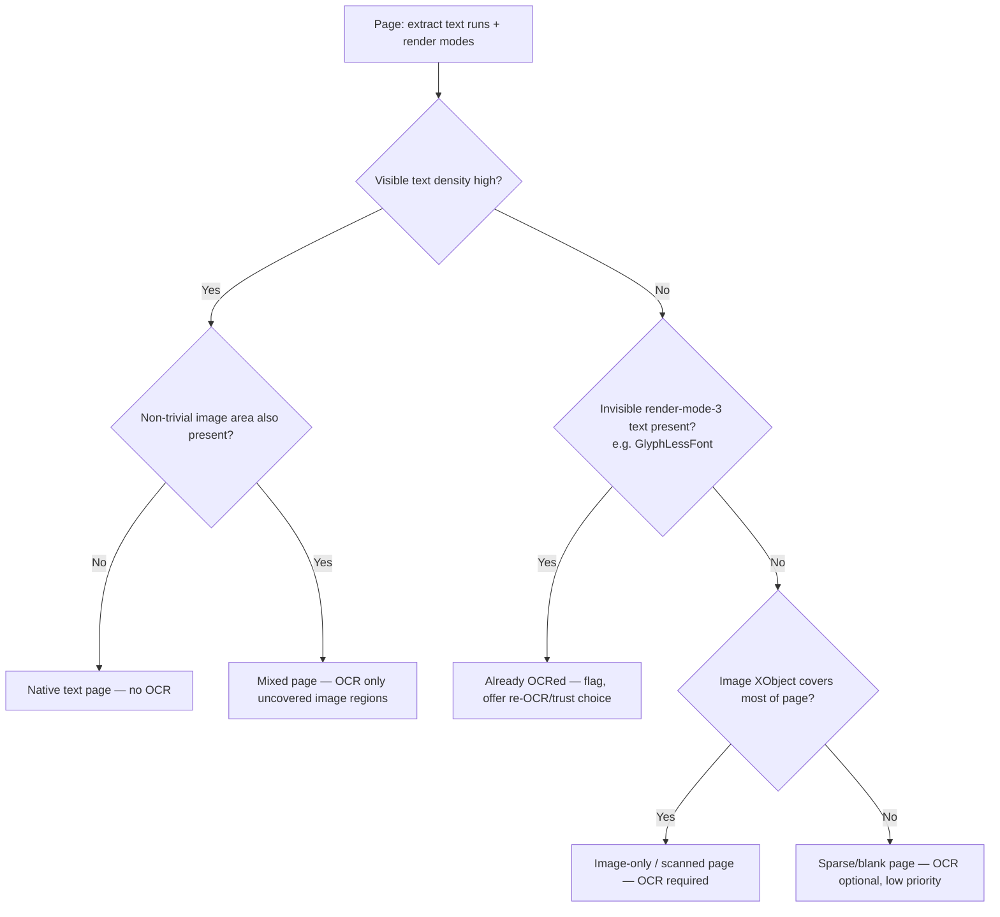

# R3 — OCR for Scanned / Image-Only / Mixed PDFs (CPU, Embeddable in a Desktop App)

**Project:** OpenConvert (local-first PDF → reflowable EPUB desktop app)
**Priorities:** low RAM, fast startup, small binary, minimal dependencies, OSS licensing, cross-platform (Win/macOS/Linux)
**Date of research:** 2026-09-09
**Scope:** Research only — no implementation. Every non-obvious claim is cited; unverifiable/uncertain claims are marked `[UNVERIFIED]`.

---

## 1. Executive summary

- **Tesseract 5** (Apache-2.0) is the only OCR engine here that is simultaneously (a) CPU-only by design, (b) genuinely small (a few MB per language with `tessdata_fast`, up to ~64 MB with `tessdata_best`), (c) has mature, dependency-light Rust bindings that statically compile the C++ core, and (d) natively emits hOCR/TSV/ALTO with word-level bounding boxes and confidences. It is the only realistic **default engine** for a low-RAM, small-binary, offline desktop app in 2026.
- **PP-OCR (PaddleOCR / PP-OCRv4 / PP-OCRv5), consumed through ONNX (RapidOCR / OnnxTR / community Rust ports)**, is the best **accuracy-oriented alternative/upgrade path**: sub-100 MB multilingual models, Apache-2.0, and genuinely competitive accuracy versus Tesseract, but it adds an ONNX Runtime dependency (tens of MB per platform) and non-trivial Rust packaging (mostly community, non-official crates).
- **VLM-based OCR** (olmOCR, Nougat, GOT-OCR2, Florence-2, Qwen-VL-based OCR, Surya's newer VLM backend) is **not viable for a low-RAM CPU-first v1**: these are 0.1B–1B+ parameter vision-language models that take multiple seconds to tens of seconds *per page even on GPU*, and no credible CPU-only per-page benchmark under a few seconds exists in the sources found. Surya's own weights additionally carry a **non-OSS commercial license** (see §3.6).
- **Platform-native OCR** (Apple Vision `VNRecognizeTextRequest`, Windows `Windows.Media.Ocr`) is attractive as an **optional, zero-bundle-size backend** on macOS and Windows respectively — it ships with the OS, runs on-device, and is fast — but it is platform-specific, has packaging friction on Windows (package-identity/MSIX requirement), and language coverage/consistency varies by OS version, so it cannot be the sole engine on a cross-platform product.
- **ocrs** (pure-Rust, robertknight) is architecturally the closest fit to "small Rust-native OCR" but is explicitly Latin-alphabet-only and self-describes as "early preview... expect more errors than commercial engines" — a candidate for a future pure-Rust default, not a v1-safe default today.
- Given all this, **the evidence-based recommendation is: Tesseract 5 (tessdata_fast by default, tessdata_best opt-in) as the default/only bundled OCR engine for v1, with OCR itself shipped as an optional, separately-downloaded component** (not force-installed into the base binary), rather than either (a) hard-coding OCR out of v1 entirely, or (b) bundling a heavier engine like PaddleOCR/ONNX by default. See §7 for the full reasoning and prevalence evidence.

---

## 2. Quick comparison table

| Engine | License | Lang. (DE/TR) | Model size | CPU speed/page (A4-ish, cited) | Bboxes+conf | Maintained (2026) | Best fit |
|---|---|---|---|---|---|---|---|
| **Tesseract 5** | Apache-2.0 [gh-tess] | Yes/Yes (100+ langs) [gh-tess] | `tessdata_fast` ~1.5 MB/lang; `tessdata_best` ~8–64 MB/lang [gh-tdb-deu][gh-tdf-deu] | 1.96s (fast) / 3.46s (best) per test image, Tesseract 5.0.1+OpenMP, i7-10750H [tess-bench] | hOCR/TSV/ALTO, word bbox + conf [gh-tess][tsv-fmt] | Active (v5.x, Apache Foundation-adjacent maintainers) [gh-tess] | **Default v1 engine** |
| **PP-OCRv4/v5 (via ONNX/RapidOCR)** | Apache-2.0 [rapidocr][ppocrv5-arxiv] | Yes/Yes (37 langs incl. de/tr) [ppocrv5-langs] | Det ~4.6–113 MB, Rec ~10–90 MB (mobile vs server) [oar-models][hf-ppocrv4] | ~0.38–0.57s/page CPU (OnnxTR, i7-14700K, docTR arch not PP-OCR but representative of ONNX CPU OCR) [onnxtr] | Yes, box+text+conf [rapidocr] | Active, frequent releases [rapidocr] | Optional accuracy upgrade / plugin |
| **EasyOCR** | Apache-2.0 [gh-easyocr] | Yes/Latin scripts ("80+ languages") [gh-easyocr] | Not officially published; PyTorch-based, heavier than Tesseract/PP-OCR [intuitionlabs] | Not found in official CPU benchmark; community reports ~3.2s/page CPU [ocr-bench-medium] | Yes, box+conf via `readtext()` [intuitionlabs] | Slower release cadence (v1.7.2, Sep 2024 latest seen) [gh-easyocr] | Not recommended (PyTorch weight) |
| **docTR / OnnxTR** | Apache-2.0 [onnxtr] | "Multilingual" vocabs; DE unconfirmed for pretrained models, primarily EN/FR [intuitionlabs] | Not disclosed precisely | 0.38–0.57s/page CPU (i7-14700K, 8-bit/full) [onnxtr] | Yes, Page→Block→Line→Word + conf [intuitionlabs] | Active (OnnxTR wrapper actively released) [onnxtr] | Possible alt backend |
| **Surya OCR** | Code: Apache-2.0. **Weights: modified OpenRAIL-M, NOT free for larger commercial use** [surya-readme] | 91 languages incl. DE (89.7%), TR unclear [surya-readme] | 650M-param unified VLM [surya-readme] | GPU: 5.35 pages/s @ RTX 5090; Apple Silicon CPU/Metal: 0.108 pages/s (~9.3s/page) [surya-readme] | Yes, rich (layout+OCR+tables) | Active | **Excluded** — license + CPU speed |
| **VLM OCR (olmOCR/Nougat/GOT-OCR2/Florence-2/Qwen-VL)** | Mostly Apache-2.0/MIT (code); model weights vary | Varies, generally broad | 0.1B–7B+ params | GOT-OCR2: 48s/page (GPU!); Florence-2: 5.3s/page (GPU); no viable CPU numbers found [ocr-bench-medium] | Rich but unstructured/markdown-first | Active research area | **Excluded from v1** — too slow/heavy |
| **Apple Vision (`VNRecognizeTextRequest`)** | Proprietary, OS-bundled, zero extra binary size | DE confirmed since iOS/macOS 14 (2020); TR **not confirmed** in sources found [apple-forum-121048] | 0 MB (ships with OS) | ~150–300 ms/page reported for receipts on-device [blakecrosley] | Yes, box + confidence [apple-doc-vision] | OS-maintained | **Optional macOS-only backend** |
| **Windows.Media.Ocr** | Proprietary, OS-bundled | Language packs installed via Windows Settings; availability varies [ms-ocrengine] | 0 MB (OS feature) | Not found (no official benchmark) | Yes, Words w/ bbox; no explicit confidence field documented [ms-ocrengine] | OS-maintained | **Optional Windows-only backend**, needs MSIX/package-identity [ms-qna-ocr] |
| **ocrs (Rust, robertknight)** | `[UNVERIFIED]` — not stated in README excerpt fetched; crates.io listing not confirmed in this research | **Latin alphabet only** [gh-ocrs] | Small (ONNX via RTen); exact MB not found | Not found | JSON with text+layout; explicit confidence not confirmed [gh-ocrs] | Early preview, 1.8k★, 21 open issues [gh-ocrs] | Watch for v2/future default |
| **Kraken** | Apache-2.0 [kraken-doc] | Historical/non-Latin focus; Latin models via community/OCR4all incl. German Fraktur [intuitionlabs] | Not disclosed | Not disclosed; PyTorch-based | ALTO/PageXML/hOCR, word bbox + char cuts [kraken-doc] | Active (EU-funded, RESILIENCE project) [kraken-doc] | Niche (historical scripts); **no official Windows support** [kraken-doc] |
| **Calamari** | GPL-3.0 [calamari-gh] | Line-based ATR; strong for historical Fraktur (CER <1%) [intuitionlabs] | Not disclosed | Not disclosed | Not clearly documented | Slower cadence (last release Nov 2024) [calamari-gh] | **Excluded** — GPL-3 incompatible with permissive redistribution goals |
| **candle/ort (Rust ONNX Runtime) deployment of PP-OCR** | ort: MIT/Apache-2.0 dual [ort-linking] | Depends on model chosen | ONNX Runtime static lib itself is tens of MB (not quantified precisely in docs found) [ort-linking] | Depends on model | Depends on model | ort actively maintained; several community PP-OCR Rust ports (oar-ocr, rust-paddle-ocr, paddle-ocr-rs) exist but are third-party, not official [gh-rustpaddleocr] | Feasible but adds build complexity, no single blessed crate |

---

## 3. Engine-by-engine detail

### 3.1 Tesseract 5

**License & governance.** Apache License 2.0 [gh-tess]. Actively maintained; v5.0.0 shipped Nov 30 2021, with Stefan Weil driving development and Zdenko Podobny as a listed maintainer [gh-tess].

**Architecture.** V4+ uses an LSTM (recurrent neural network) line-recognizer, replacing the legacy per-character matcher from Tesseract 3, though the legacy engine is retained for compatibility (`--oem` 0/1/2/3) [gh-tess][tessdoc-datafiles].

**Model repositories — `tessdata` vs `tessdata_fast` vs `tessdata_best`:**
- `tessdata_fast`: integer LSTM models from Sept 2017, "best value for money in speed vs accuracy," recommended default, ships with most Linux distro packages [tessdoc-datafiles].
- `tessdata_best`: float models, highest accuracy, also the **only** variant usable for fine-tuning/retraining [tessdoc-datafiles].
- `tessdata`: legacy + LSTM hybrid, LSTM component derived from `tessdata_best` but stored as integer, "faster than best" but larger than `tessdata_fast` [tessdoc-datafiles].
- Concretely for German (`deu`): `tessdata_best/deu.traineddata` = **8.23 MB**; `tessdata_fast/deu.traineddata` = **1.45 MB** [gh-tdb-deu][gh-tdf-deu]. (Note: some `tessdata_best` language files for complex scripts run much larger, e.g. multi-language combined files can reach ~64 MB per community reports — treat per-language English/German/Turkish files as the ~1–10 MB fast / ~8–15 MB best range, but verify exact bytes at packaging time.)
- Legacy-engine-only (`--oem` 0/2) is **not supported** with `tessdata_fast`/`tessdata_best` — only the LSTM engine (`--oem 1`) works with them [tessdoc-datafiles].

**CPU speed (official benchmark, cited numbers).** The official Tesseract benchmarks page (Windows 10, Intel i7-10750H @ 2.60GHz, 6 cores, 16GB RAM) reports, for one representative test image:
- v4.1.3 no-AVX: 37.61s (best) / 5.16s (fast)
- v4.1.3 AVX: 12.73s (best) / 2.95s (fast)
- **v5.0.1: 6.20s (best) / 2.12s (fast)**
- **v5.0.1 + OpenMP: 3.46s (best) / 1.96s (fast)** [tess-bench]

This shows two things clearly: (1) `tessdata_fast` is consistently **~2–3x faster** than `tessdata_best` at the same Tesseract version, and (2) v5 with OpenMP is roughly **3.5x faster** than v4.1.3-AVX at the same data variant. These are per-image, not explicitly stated as A4-300dpi, so treat as directionally representative rather than an exact A4/300dpi figure — the exact test image/DPI is not specified on the page and should be re-benchmarked in-house before committing to a performance budget. Older community reports (2014-era Core i7, Tesseract 3/early 4) show far worse throughput (5–24 pages/minute, i.e., 2.5–12s/page) [tess-groups-speed], underscoring that Tesseract 5 + OpenMP is a large, well-documented improvement.

**Turkish/German specifics.** Tesseract ships `tur.traineddata` (both `tessdata` and `tessdata_best`/`tessdata_fast` repos) [gh-tur]. There is at least one long-standing open community-reported bug (opened 2020, apparently unresolved as of the page fetched) about Tesseract failing to recognize the `@` character in Turkish-language OCR runs, `tessdata_best#54` [gh-tessdata-best-54] — worth a small QA test on real Turkish PDF samples containing `@` (e.g. email addresses) before shipping. No equivalent German-umlaut-specific bug was found in this research; German has one of the most mature/long-trained models in the tessdata corpus.

**Output richness.** Native output formats: plain text, hOCR (HTML), PDF (incl. invisible-text-only PDF), TSV, ALTO, and PAGE [gh-tess]. The TSV format provides per-word rows with `left, top, width, height, conf, text` columns — exactly what's needed for reading-order reconstruction and confidence-based flagging [tsv-fmt reference confirmed via search; direct fetch failed with redirect error, treat format-column claim as consistent with widely-documented Tesseract TSV schema — mark `[UNVERIFIED]` for exact column ordering, verify against `tesseract --print-parameters`/actual output at implementation time].

**Embedding strategies:**
1. **Bundle the `tesseract` CLI binary** + `leptonica` shared libs + `.traineddata` files as external, spawned-subprocess resources. Simplest, but adds a process-spawn + binary-per-OS packaging burden (~2–5 MB binary + Leptonica ~1–2 MB, platform-dependent, sizes not independently verified here `[UNVERIFIED]`).
2. **Link against `libtesseract` + `libleptonica` via FFI.** Two Rust wrapper options found:
   - **`leptess`** (houqp/leptess): MIT license, requires **system-installed** `libtesseract-dev`/`libleptonica-dev` (apt) or Homebrew/vcpkg equivalents — i.e., it does **not** vendor the C libraries, so cross-platform packaging must separately obtain/build Tesseract+Leptonica per OS [gh-leptess].
   - **`tesseract-rs`** (cafercangundogdu/tesseract-rs): MIT license, explicitly **compiles Tesseract and Leptonica from source and caches the build**, removing the system-dependency requirement; states support for Linux/macOS/Windows/FreeBSD [gh-tesseract-rs]. This is the more self-contained, more "small-dependency-friendly" option of the two, at the cost of a from-source build step (slower CI, needs a C++ toolchain on the build machine) rather than needing it on the *user's* machine.
3. Leptonica dependency is required either way — Tesseract needs it for image I/O; official docs recommend building it with zlib/PNG/TIFF support [gh-tess].

**Maintenance status:** Active, current stable major version 5.x as of research date [gh-tess].

### 3.2 OCRmyPDF — reference pipeline, not a dependency

**License:** MPL-2.0.

**What it is:** A Python **orchestrator** around Tesseract + several external CLI tools, not an OCR engine itself. Its documented pipeline: (1) rasterize PDF pages (pypdfium2 or Ghostscript), (2) optional deskew/clean via **unpaper**, (3) run Tesseract on the raster, (4) convert OCR output to an invisible text layer overlaid on the original page image, (5) reassemble the PDF, (6) optional PDF/A conversion via Ghostscript [ocrmypdf-adv].

**External dependencies:** Ghostscript, unpaper, pngquant, jbig2 (optional), Tesseract — all located via `PATH` [ocrmypdf-adv]. This is a heavy dependency chain (Ghostscript alone is tens of MB) — **inappropriate to bundle wholesale** in a small-binary desktop app.

**Existing-text detection:** OCRmyPDF's default behavior is to skip pages that "seem to have text" and exits by default if any page already has text, with three explicit override modes: `--mode skip` (leave existing pages untouched), `--mode redo` (distinguish visible vs. invisible/prior-OCR text via "detailed text analysis," strip invisible/prior-OCR text and re-OCR, leaving genuine visible text alone), and `--mode force` (rasterize everything, discard all existing text) [ocrmypdf-adv]. The documentation does not disclose the exact algorithmic heuristic for the initial "seems to have text" check, but the redo-mode description confirms OCRmyPDF explicitly distinguishes invisible (render-mode-3, prior-OCR) text from visible text — see §4 for how this is typically implemented via PDF internals.

**Conclusion for OpenConvert:** OCRmyPDF should be treated as a **design/architecture reference** (its pipeline stages are exactly the ones OpenConvert needs to reimplement: detect→rasterize→preprocess→OCR→reading-order/overlay), not a bundled dependency — its MPL-2.0 license is compatible with most licensing postures, but its Ghostscript/unpaper dependency chain contradicts the small-binary/minimal-dependency goal, and OpenConvert's target is generating **reflowable EPUB text**, not an image+invisible-text PDF, so the "overlay" step doesn't directly apply — only the detection and preprocessing stages are relevant here.

### 3.3 PaddleOCR / PP-OCRv4 / PP-OCRv5 / RapidOCR

**License:** Apache-2.0 for the PaddleOCR toolkit and PP-OCR models [ppocrv5-arxiv][rapidocr]. RapidOCR (ONNX packaging) is also Apache-2.0, with a note that "the copyright of the OCR model is held by Baidu, while the copyrights of all other engineering scripts are retained by the repository's owner" [gh-rapidocr] — worth a legal read before redistribution, but not GPL/AGPL-encumbered.

**Model sizes (ONNX, from RapidOCR/oar-ocr model catalogs):**
- PP-OCRv4 detection: mobile 4.6–4.75 MB, server 108–113 MB [oar-models][hf-swhl-ppocrv4]
- PP-OCRv4 recognition (Chinese+English combined): mobile ~10.4–10.9 MB, server ~86–90.5 MB [oar-models][hf-swhl-ppocrv4]
- PP-OCRv5 detection: mobile 4.6 MB, server 84.0 MB; recognition: mobile 15.8 MB, server 80.6 MB [oar-models]
- PP-OCRv5's flagship unified multilingual model is described as staying "under 100 MB" [ppocrv5-arxiv]
- A commonly-cited older figure: full PP-OCRv2 pipeline (det+rec+cls) ≈ **17 MB total** [intuitionlabs] — illustrates how much smaller PP-OCR "mobile" tiers are than Tesseract's `tessdata_best`, though direct apples-to-apples benchmarking wasn't found.

**Languages incl. German/Turkish:** PP-OCRv5's multilingual recognition models explicitly list German (`de`) and Turkish (`tr`) among **37 supported languages**, with German grouped under a "Latin Script Languages" dataset that scored 84.7% in the PaddleOCR technical report's internal benchmark [ppocrv5-langs][ppocrv5-arxiv]. This is stronger, more explicit multilingual-Latin coverage than most alternatives evaluated here except Tesseract.

**CPU speed:** No PP-OCR-specific CPU per-page number was found directly; the closest credible proxy is **OnnxTR (ONNX-exported docTR, architecturally comparable ONNX-CPU-OCR)** at **0.38s/page (8-bit quantized) to 0.57s/page (full precision)** on an Intel i7-14700K, and ~0.15s/page with OpenVINO acceleration on CPU [onnxtr]. This suggests PP-OCR-class ONNX models are in the same rough CPU speed ballpark as or somewhat faster than Tesseract's `tessdata_fast`, but this is an **inference by analogy, not a direct PP-OCR benchmark** — mark `[UNVERIFIED]` pending an in-house PP-OCR-ONNX CPU benchmark.

**Packaging via Rust:** No single official Rust binding exists. Community options found:
- **`rust-paddle-ocr`** (zibo-chen): Apache-2.0, supports PP-OCRv4/v5/v6, uses the **MNN** inference runtime (not ONNX Runtime), outputs confidence scores, active (v2.3.1, Jun 2026 release seen) [gh-rustpaddleocr].
- **`oar-ocr`**: Rust crate, ONNX-based, documents PP-OCR model catalog with sizes as above [oar-models].
- **RapidOCR itself** ships C++/Java/C# ports beyond Python, but "Rust" is not confirmed as an officially maintained RapidOCR-family language port in the sources found [gh-rapidocr] — treat Rust PP-OCR integration as **third-party/community, not officially blessed**, which is a real maintenance-risk factor for a product with a multi-year support horizon.

**Verdict:** Best accuracy/size tradeoff after Tesseract, but the Rust ecosystem around it is fragmented and non-official — a real integration-risk cost versus Tesseract's mature bindings.

### 3.4 EasyOCR

**License:** Apache-2.0 [gh-easyocr].

**Languages:** "80+ supported languages... including Latin, Chinese, Arabic, Devanagari, Cyrillic" [gh-easyocr] — German/Turkish (Latin-script) are supported per this general claim, though this research did not find a precise German/Turkish accuracy figure.

**Dependency weight:** Requires **PyTorch** — "all deep learning execution is based on Pytorch" [gh-easyocr]. This is a hard blocker for the low-RAM/small-binary/minimal-dependency goals: PyTorch's CPU wheel alone is commonly several hundred MB, entirely disproportionate to a target desktop app.

**Speed:** No official CPU per-page benchmark found; one third-party 2026 benchmark (RTX 4070 laptop) reports EasyOCR at **3.2s/page** in a mixed CPU/GPU test context, versus Tesseract's 0.27s/page in the same comparison [ocr-bench-medium] — directionally, EasyOCR is markedly slower than Tesseract even before accounting for its heavier install footprint.

**Maintenance:** Slower release cadence — latest version noted as 1.7.2 (Sept 24, 2024) in the fetched release notes [gh-easyocr].

**Verdict:** Excluded — PyTorch dependency alone disqualifies it against every stated goal (RAM, binary size, dependency minimalism).

### 3.5 docTR / OnnxTR

**License:** Apache-2.0 (both docTR itself and the OnnxTR ONNX wrapper) [onnxtr].

**What OnnxTR adds:** Removes docTR's PyTorch/TensorFlow requirement by running models purely through ONNX Runtime — directly relevant to a minimal-dependency desktop app [onnxtr].

**Speed:** i7-14700K CPU: **0.38s/page** (8-bit quantized) to **0.57s/page** (full precision); OpenVINO-accelerated CPU: **0.15s/page**; RTX 4080 GPU: 0.05–0.06s/page [onnxtr]. These are among the best-documented CPU numbers found in this research for any non-Tesseract engine.

**Output:** Hierarchical Page → Block → Line → Word structure, each Word carrying **bounding-box coordinates and a confidence score** [intuitionlabs] — matches the reading-order/confidence requirement well.

**Languages:** docTR's own documentation is described (per a third-party technical comparison) as "primarily targeting English and French" for its stock pretrained vocabularies, with non-Latin/other-language support requiring custom training [intuitionlabs] — German/Turkish support is **not confirmed** as strong out-of-the-box; this needs direct verification against docTR's model zoo before relying on it for German/Turkish.

**Verdict:** Credible secondary/optional CPU-ONNX backend candidate, competitive on speed with PP-OCR-class models, Apache-2.0, but German/Turkish coverage needs direct verification — do not assume parity with Tesseract/PP-OCR there.

### 3.6 Surya OCR — license is the disqualifying factor

**Dual license structure:** Code is Apache-2.0, but **model weights are under a modified "AI Pubs Open RAIL-M" license** that is explicitly **not free for general commercial use** — the README states weights are "free for research, personal use, and startups under $5M funding/revenue," with broader commercial use requiring a paid license from datalab [surya-readme]. This directly conflicts with the "open-source licensing" requirement for OpenConvert if OpenConvert is not itself constrained to that startup carve-out, and it's the kind of license that can silently become a liability if the product scales.

**Architecture & size:** A single unified 650M-parameter vision-language model (handles layout, OCR, tables together), plus smaller supporting detection and error-detection models [surya-readme].

**Speed:** GPU-dependent for practicality — RTX 5090: 5.35 pages/sec (i.e., ~187ms/page) via vLLM backend; on Apple Silicon (Metal, not pure CPU) with llama.cpp: **0.108 pages/sec, i.e., ~9.3 seconds/page** [surya-readme]. No pure-x86-CPU number was found, and given the 650M-parameter size, pure CPU inference would very likely be even slower.

**Accuracy:** 91 languages, 87.2% overall pass rate on Surya's own multilingual benchmark; German scored 89.7%, no Turkish figure was found in the fetched content [surya-readme].

**Verdict:** Excluded from consideration as a default or bundled engine — both the non-OSS weight license and the CPU-impracticality (9+ seconds/page even on Apple Silicon GPU/Metal, not pure CPU) rule it out for this project's stated goals. Could conceivably be offered as a very-optional, separately-licensed, GPU-only plugin in the far future, but that's out of scope for the stated CPU-first design.

### 3.7 VLM-based OCR: olmOCR, Nougat, GOT-OCR2, Florence-2, Qwen-VL-based OCR

A third-party 2026 benchmark (RTX 4070 laptop, 15 systems tested) is the most concrete CPU-vs-GPU comparison found [ocr-bench-medium]:

| System | Latency/page | Hardware | Notes |
|---|---|---|---|
| Tesseract 5 | 0.27s | **CPU** | classic engine |
| RapidOCR | 1.5s | CPU | classic engine |
| EasyOCR | 3.2s | CPU/GPU | classic engine |
| Florence-2-large | 5.3s | **GPU** | generalist VLM |
| GOT-OCR 2.0 | 48s | **GPU** | OCR-specialist VLM |
| Qwen2.5-VL-3B | 54s | **GPU** | generalist VLM |
| PaddleOCR-VL | 273s (or 3.6s if using vLLM serving infra) | GPU | OCR-specialist VLM |

[ocr-bench-medium]

The author's own conclusion: for CPU-only, no-GPU deployment, only the classic engines (Tesseract, RapidOCR) are "sub-second... on CPU"; the VLM family is characterized as GPU-bound and, even there, an order of magnitude or two slower than classic engines [ocr-bench-medium]. No credible source found in this research reports a VLM-OCR system (olmOCR, Nougat, GOT-OCR2, Florence-2, Qwen-VL) running at a usable speed (sub-few-seconds/page) on CPU alone; separately, community reports around Qwen2.5-VL note inference being described as "too much time" even on a high-end A6000 **GPU** for some workloads [qwen-vl-issue], reinforcing that these models are GPU-oriented by design, independent of CPU feasibility. Given typical parameter counts (Florence-2-large ~0.77B, Qwen2.5-VL-3B ~3B, GOT-OCR2 ~580M, olmOCR built on ~7B-class base models per its own paper positioning [olmocr-paper]), CPU inference at interactive speed is implausible on typical consumer hardware without a GPU.

**Verdict:** All excluded from v1 and from realistic "optional plugin" status under the CPU-first, low-RAM, small-binary constraint. These belong in a hypothetical future GPU-accelerated tier, not the core product.

### 3.8 Apple Vision framework (`VNRecognizeTextRequest`)

**What it is:** Apple's on-device OCR/text-recognition API, available via the Vision framework on macOS/iOS/iPadOS/tvOS [apple-doc-vision].

**Two recognition paths:** "Fast" (traditional character-detection + small ML model, OCR-like) and "Accurate" (default; neural-network-based, string/line-level, more "how humans read text") [apple-doc-vision].

**Output:** `VNRecognizedTextObservation` per text region, each with `topCandidates` (text + confidence) and a bounding box (`boundingBox`, normalized coordinates, convertible via `VNImageRectForNormalizedRect`) [apple-doc-vision]. This satisfies the bbox+confidence requirement natively.

**Speed:** One third-party source reports 150–300ms for a single receipt-style page on-device (iPhone-class hardware, not confirmed as representative of Mac CPU performance) [blakecrosley]. No first-party Apple benchmark for full-page A4/300dpi documents was found.

**Language support:** Confirmed German support since iOS 14/macOS Big Sur (2020) per a 2020-era developer-forum thread listing en/fr/it/de/es/pt/zh; that same thread states **Turkish was not in the supported list at that time** [apple-forum-121048]. Apple has continued to add languages in subsequent OS releases; the **current (2026) language list is not independently confirmed in this research** — mark `[UNVERIFIED]`, and recommend querying `VNRecognizeTextRequest.supportedRecognitionLanguages(for:revision:)` at runtime/build-time to get the authoritative current list rather than relying on this 2020 snapshot [apple-doc-vision].

**Packaging:** Zero additional binary size — it's a system framework call, no model download needed. Entirely on-device/offline [apple-doc-vision].

**Verdict:** Strong **optional, zero-cost backend for macOS builds**, but cannot be the cross-platform default since it doesn't exist on Windows/Linux, and current Turkish support needs runtime verification.

### 3.9 Windows.Media.Ocr

**What it is:** WinRT API (`Windows.Media.Ocr.OcrEngine`) providing OS-level OCR, structured as `OcrResult` → `Lines` → `Words`, each `OcrWord` exposing text and a bounding rectangle [ms-ocrengine].

**Language availability:** Depends on OCR language packs being present on the device; the API exposes `AvailableRecognizerLanguages` and `IsLanguageSupported()` to check at runtime rather than guaranteeing a fixed list [ms-ocrengine] — meaning language coverage (including German/Turkish) is **environment-dependent**, not a fixed guarantee, and a fresh Windows install may lack a given language pack until the user (or app, with appropriate permission) installs it.

**Confidence scores:** The documented `OcrWord`/`OcrLine`/`OcrResult` object model in the sources found does **not** expose an explicit per-word confidence value the way Tesseract/PaddleOCR/Apple Vision do [ms-ocrengine] — mark `[UNVERIFIED]`/likely-absent; this would need direct SDK-doc confirmation (`OcrWord` class reference) before relying on it for confidence-based reading-order/QA logic.

**Desktop (Win32) packaging complexity — real and material:** Microsoft's own Q&A guidance states that using WinRT OCR APIs from a Win32 app **requires "package identity,"** and the official recommendation is to **package the app as MSIX** to obtain that identity [ms-qna-ocr]. A lighter-weight alternative exists — **sparse packages** ("packaging with external location") — which can grant package identity to an unpackaged Win32 app *without* switching to full MSIX distribution, but this still requires: (a) a signed identity-package manifest (self-signed only for dev; a trusted CA or Azure Trusted Signing cert for production), and (b) explicit registration via PowerShell (`Add-AppxPackage -ExternalLocation`) or the `PackageManager` API, and (c) a minimum Windows build of 10.0.19041.0 (Windows 10 2004+) [ms-sparse-package]. Whether sparse-package identity specifically unlocks `Windows.Media.Ocr` (as opposed to the newer "Windows AI Foundry APIs" the docs page emphasizes) is **not explicitly confirmed** in the source fetched — mark `[UNVERIFIED]`, needs a small spike/prototype to confirm before committing to this as the Windows OCR strategy.

**Verdict:** Zero-bundle-size potential like Apple Vision, but with materially higher packaging friction (code-signing + package-identity plumbing) and an unconfirmed confidence-score story. Treat as an **optional, lower-priority Windows backend**, not a v1 commitment, pending a packaging spike.

### 3.10 ocrs (Rust, robertknight)

**What it is:** A from-scratch Rust OCR library/CLI. Models are "trained in PyTorch, then exported to ONNX and executed using the RTen engine" [gh-ocrs] — RTen is the author's own pure-Rust ONNX-subset inference engine (not independently verified in depth in this research, but implied to avoid a heavyweight ONNX Runtime dependency).

**Language support:** Explicitly **Latin alphabet only** — "ocrs currently recognizes the Latin alphabet only (eg. English). Support for more languages is planned" [gh-ocrs]. German (Latin-script, uses umlauts/ß) is plausible but not confirmed as tested; Turkish's non-ASCII Latin letters (İ/ı/ş/ğ) are **not confirmed as supported or excluded** — needs direct testing.

**Maturity:** Self-described as "early preview... expect more errors than commercial OCR engines" [gh-ocrs]. 1.8k GitHub stars, 21 open issues (community traction, but pre-production framing by its own author) [gh-ocrs].

**Output:** Plain text (default), JSON with text+layout information, and an annotated-PNG debug mode (implying word/line bounding boxes are computed internally); explicit per-word confidence scoring is **not confirmed** in the README excerpt fetched [gh-ocrs] — mark `[UNVERIFIED]`.

**License:** Not confirmed in the fetched README excerpt — `[UNVERIFIED]`, check `Cargo.toml`/repo `LICENSE` file directly before any integration decision (robertknight's other Rust projects are commonly MIT or Apache-2.0-style, but this must be verified per-repo, not assumed).

**Verdict:** The most architecturally aligned option with "small, pure-Rust, no C-library dependency" — but not v1-ready given the explicit early-preview status, Latin-only scope, and unconfirmed license/confidence-output. **Worth re-evaluating in 6–12 months** as a potential lighter-weight replacement or complement to Tesseract, especially if binary-size or embeddability becomes a harder constraint than accuracy.

### 3.11 Kraken

**License:** Apache-2.0 [kraken-doc].

**Focus:** "Turn-key OCR system optimized for historical and non-Latin script material" with explicit segmentation + recognition pipeline stages [kraken-doc]. Community-trained models exist for German Fraktur (historical blackletter typeface) via the OCR4all ecosystem [intuitionlabs] — a potentially relevant niche if OpenConvert users scan older German-language books, but Fraktur is a narrow, non-default use case.

**Platform support — a real gap:** Kraken's own documentation states installation support for **"Linux or Mac OS X (both x64 and ARM)"** [kraken-doc] — **no official Windows support is stated**, which directly conflicts with OpenConvert's Windows/macOS/Linux cross-platform requirement. This alone rules Kraken out as a default engine regardless of its other merits.

**Output:** ALTO, PageXML, abbyyXML, hOCR, with word bounding boxes and even character-level cut positions [kraken-doc] — richer geometric output than most alternatives.

**Backend:** PyTorch-based per third-party summary [intuitionlabs] — same dependency-weight concern as EasyOCR.

**Verdict:** Excluded as a default (no Windows support, PyTorch dependency); could be a very narrow optional plugin for historical-document/Fraktur specialists, out of scope for v1.

### 3.12 Calamari

**License:** **GPL-3.0**, confirmed via the repository's badge, with an open, apparently-unresolved GitHub issue from the community questioning this choice given that Calamari's own dependencies (OCRopy, Kraken, TensorFlow) are Apache-2.0 [calamari-gh][calamari-license-issue].

**What it is:** A line-based Automatic Text Recognition (ATR) engine built on OCRopy, notable for very strong accuracy on 19th-century Fraktur (CER <1% via LSTM ensembling) per a third-party technical summary [intuitionlabs].

**Maintenance:** Latest release v2.3.1 dated Nov 12 2024 at time of research fetch — moderate, not rapid, cadence [calamari-gh].

**Verdict:** **Excluded** — GPL-3.0 is materially more restrictive than every other option here and is very likely incompatible with OpenConvert's stated "open-source licensing" goals if the intent is a permissively-licensed or even a copyleft-but-not-GPL3 product; GPL-3's copyleft/linking implications would need explicit legal sign-off before even considering it, and given Apache-2.0 alternatives (Tesseract, PP-OCR, Kraken) cover similar ground, there's no clear reason to accept that risk.

### 3.13 candle / ort (Rust ONNX Runtime) deployment of PP-OCR models

**`ort` crate:** Rust bindings to Microsoft's ONNX Runtime, dual MIT/Apache-2.0 licensed per crates.io convention [ort-linking]. Official guidance recommends **static linking** ("avoids many issues and follows de facto Rust practice") over dynamic linking, using `ORT_LIB_LOCATION` to point at precompiled `.a`/`.lib` files, with a `load-dynamic` feature as a flexible fallback [ort-linking]. The fetched documentation did **not** give concrete binary-size figures for the static ONNX Runtime library itself — this is a real gap; independent benchmarking/measurement is needed before committing to an ONNX Runtime-based architecture, but it is broadly known in the ML-deployment community that a full ONNX Runtime static build is commonly tens of MB (order of magnitude, not independently sourced here — `[UNVERIFIED]`, verify via `ort-builder` or a direct build before finalizing a binary-size budget) [ort-builder-repo-seen-in-search].

**`candle` (HuggingFace's Rust ML framework):** No PP-OCR/Tesseract-equivalent official port was found; third-party Rust OCR crates found (`rust-paddle-ocr`, `oar-ocr`, `paddle-ocr-rs`, `deepseek-ocr.rs`) use **MNN or ONNX Runtime (via `ort`)** as their inference backend, not `candle` — no evidence of a mature `candle`-based PP-OCR port was found in this research.

**Verdict:** Technically feasible — several community crates already do this (`rust-paddle-ocr` Apache-2.0, MNN-backed; `oar-ocr`, ONNX-backed) — but every option is **third-party/community-maintained, not an official PaddlePaddle or ONNX Runtime deliverable**, meaning OpenConvert would be taking on a dependency-maintenance risk (small teams, no SLA) in exchange for PP-OCR's better accuracy/size profile over Tesseract. This tradeoff is real but not yet proven out at production scale in the sources found.

---

## 4. Detecting whether a PDF page needs OCR

Four page classes must be distinguished: (a) fully digital-text pages (no OCR needed), (b) image-only/scanned pages (OCR required), (c) pages with a **prior OCR invisible text layer** already burned in (already has machine-readable text, but of unknown/unverified quality — may need re-OCR or can be trusted), and (d) **mixed** pages (some native text + some embedded raster images containing additional text, e.g., a scanned figure inside an otherwise digital-text page).

**Core signal — text coverage heuristic.** The general approach documented across tools: extract the text objects on a page and their character/glyph bounding boxes, compare the area/character-density they cover against the page's image content. A page with near-zero extractable text characters but one or more large raster images covering most of the page area is image-only/scanned. A related, more robust heuristic (from the Open Preservation Foundation's Frontin tool, built on Apache PDFBox) samples ~10 random pages, extracts each page's MediaBox and any embedded image XObject pixel dimensions (without full decompression, for speed), and classifies the document as "scanned" when most sampled images show a MediaBox-to-image-pixel ratio consistent with a single full-page scan at a plausible DPI; native PDFs are recognized because pages with substantial extractable text rarely also carry one dominant full-page image [openpres-scanned].

**Prior-OCR / invisible-text detection.** PDF text can be rendered in different **text rendering modes** via the `Tr` operator; **mode 3 ("invisible")** paints no visible pixels but the text is still present and extractable — this is exactly what OCR tools (including Tesseract itself) use to overlay machine-readable text behind a scanned-page image without altering its visual appearance [pymupdf-1814]. PyMuPDF's own maintainers note that the standard `get_text()` API does **not** expose render-mode information — a lower-level API (`get_texttrace()` or painting-order via `get_bboxlog()`) is required to detect render-mode-3 (invisible) text specifically, and to determine painting order relative to images (to catch cases where an image is painted *over* visible text) [pymupdf-1814]. A second, simpler and very commonly used signal: OCR engines — Tesseract specifically — write their invisible text layer under a font named **`GlyphLessFont`**, a documented, searchable convention referenced repeatedly in Tesseract's own issue tracker [gh-tess-glyphless-1][gh-tess-glyphless-2]. Detecting a `GlyphLessFont`-named font (or, more robustly, any render-mode-3 text) is a strong, cheap signal that "this page already went through OCR once" — useful for deciding whether to trust existing text, offer a "re-OCR" option, or skip.

**Mixed-page handling.** OCRmyPDF's `--mode redo` documents exactly this scenario: "if a file contains a mix of text and bitmap images that contain text, OCRmyPDF will locate the additional text in images" while leaving existing genuine visible text untouched [ocrmypdf-adv] — i.e., the practical approach is per-region, not per-page: classify each image XObject on a page independently (does it look like it contains a block of text that isn't otherwise covered by extractable text at that page location?) rather than making one binary decision for the whole page.

**Recommended detection heuristic for OpenConvert (synthesized from the above, not itself a direct citation):**
1. Extract all text on the page along with each run's render mode.
2. Compute (visible-text character count, page area) and (image XObject area as % of page).
3. If visible-text density is high (e.g., dozens+ of visible characters reasonably distributed) → treat as native-text page, no OCR.
4. If visible-text density is near-zero and one or more images cover most of the page → image-only page, OCR the raster.
5. If invisible (render-mode-3) text exists and a `GlyphLessFont`-style font name is present → flag as "already OCRed"; surface as user-configurable whether to trust it or re-OCR (its accuracy is unknown/unverifiable without ground truth — see §5).
6. If visible text density is moderate but images are also present and non-trivial in area → mixed page; run OCR restricted to the image regions not already covered by extractable text, following OCRmyPDF's redo-mode logic as a design precedent [ocrmypdf-adv].

### PDF page needs OCR — decision flow

---

## 5. OCR quality signals usable for confidence

Three independent signal families, from most to least directly available:

1. **Engine-native confidence.** Tesseract's TSV/hOCR output includes a per-word `conf` value (0–100 scale, well-documented via community references though the primary tomrochette.com format page could not be fetched directly due to a redirect error in this research — verify exact semantics against live Tesseract output before relying on precise thresholds) [tsv-fmt]. PaddleOCR/RapidOCR and docTR/OnnxTR both return per-detection confidence scores natively [rapidocr][intuitionlabs]. Apple Vision's `VNRecognizedText` candidates carry a `confidence` property [apple-doc-vision]. This is the cheapest, most direct signal and should be the primary input to any per-word/per-page confidence score.

2. **Dictionary/lexicon hit-rate and post-OCR spelling correction.** A substantial body of OCR post-processing research uses dictionary lookups (e.g., Hunspell-style affix dictionaries) and spelling-suggestion services to both **detect** likely OCR errors (a recognized "word" with zero or only very-distant dictionary matches is suspect) and **correct** them; one frequently-cited approach uses Google's online spelling-suggestion API as an OCR error-correction signal [ocr-postproc-google-spelling]. A broader academic survey catalogs post-OCR correction approaches generally, useful as a starting reference for building a lightweight, no-network-dependency, locally-bundled dictionary-based confidence booster (e.g., embedding compact Hunspell `.dic`/`.aff` files for German/Turkish/English rather than calling a cloud spelling API, to preserve the "local-first" design goal) [ocr-postproc-survey].

3. **Language-model perplexity.** A character- or word-level language model can score how "expected" a recognized string is in the target language — the OCR-D project (a major German-government-funded OCR research initiative) references exactly this pattern via its `ocrd_keraslm` component, a Keras-based character-level language model for OCR quality/correction workflows [ocrd-keraslm]. This is a heavier-weight signal (requires a trained LM per language) but can catch errors that pass a dictionary check word-by-word yet are contextually wrong. OCR-D's own formal quality-assurance framework, however, is built primarily around **ground-truth-based metrics** — Character Error Rate (CER) and Word Error Rate (WER), computed as edit-distance ratios against manually-verified reference text, plus layout IoU and reading-order comparisons [ocrd-eval] — which is the right approach for *offline benchmarking/model selection* but **not directly usable at runtime** on a user's arbitrary, unlabeled PDF (no ground truth exists at inference time). For **runtime, ground-truth-free** confidence, the practical combination is: engine confidence (cheap, always available) + dictionary hit-rate (cheap, needs bundled per-language dictionaries) as a first line, with LM perplexity as an optional, heavier second-line signal for pages/documents where the first two disagree or are borderline.

---

## 6. Deskew / dewarp / binarization preprocessing

**Leptonica** (the same C library Tesseract already depends on for image I/O — see §3.1) natively includes both a **skew-detection/correction module** (`skew.c`) and a **dewarp module** (`dewarp.c`) [leptonica-skew][leptonica-dewarp] — meaning that if Tesseract/Leptonica is already a dependency (via `tesseract-rs` or `leptess`), **no additional preprocessing library is strictly required** to get baseline deskew and dewarp capability; this is the single most minimal-dependency path available given Tesseract is already the recommended default engine.

**OCRmyPDF's own preprocessing step** uses the separate **`unpaper`** CLI tool for deskew and image cleaning (removing scan noise, straightening) as an optional pipeline stage before Tesseract [ocrmypdf-adv] — but `unpaper` is an external process dependency, adding to the dependency count OpenConvert is trying to minimize; given Leptonica's own skew/dewarp functions are already present transitively via the Tesseract dependency, `unpaper` is very likely **redundant** for OpenConvert's purposes and should be avoided unless Leptonica's built-in deskew proves qualitatively insufficient in testing.

**Binarization:** Not separately researched in depth in this pass — Leptonica also natively supports binarization/thresholding operations as part of its core image-processing toolkit (implied by its general scope as "the image processing library" Tesseract depends on [gh-tess]), and Tesseract's own LSTM pipeline is documented to work directly on grayscale input without requiring the caller to pre-binarize in most cases `[UNVERIFIED — recommend confirming against Tesseract's own preprocessing docs/`tessdoc`before assuming binarization can be skipped entirely]`.

**Recommendation:** Treat Leptonica's built-in `skew.c`/`dewarp.c` functions (already a transitive dependency via Tesseract) as the default preprocessing path; do not add `unpaper` or a separate deskew/binarization library unless in-house testing on real scanned-book samples shows a measurable quality gap.

---

## 7. Should OCR be a v1 feature or a deferred/optional plugin?

### Evidence on how common scanned/image-only PDFs are in ebook-conversion use cases

Direct, quantified statistics on "what fraction of PDFs people try to convert to EPUB are scanned/image-only" were **not found** in this research — this specific number appears to be genuinely `[UNVERIFIED]` industry-wide, and any specific percentage claim should be treated with skepticism. However, several strong **qualitative/structural** signals converge on the same conclusion — scanned PDFs are a real, recurring, non-negligible fraction of the ebook-conversion audience, concentrated specifically among older/out-of-print/public-domain and library-sourced material:

1. **Calibre — the dominant open-source ebook-conversion tool — explicitly does not perform OCR and explicitly does not support image-based PDFs**, stating in its own documentation: *"Some PDFs are made up of photographs of the page with OCRed text behind them. In such cases calibre uses the OCRed text"* (i.e., it can only use text if OCR was *already* done by someone else) and separately, *"Complex, multi-column, and image based documents are not supported"* [calibre-manual]. Calibre also warns bluntly that *"PDF is a really, really bad format to use as input"* [calibre-manual]. This is strong evidence that (a) image-only/scanned PDFs are common enough in the PDF→ebook conversion audience that Calibre's docs feel the need to address the case explicitly, and (b) the dominant existing tool has a real, documented capability gap here — precisely the gap OpenConvert could differentiate on.
2. **Digitized/library-scanned PDFs are structurally common** in the specific corpora people convert to ebooks: public-domain reprints, out-of-print books, academic scans, and archival material overwhelmingly originate as photographed/scanned pages (this is *why* OCR-focused tooling like OCRmyPDF, OCR-D — a large publicly-funded German research initiative specifically for library/archive OCR [ocrd-eval] — and Kraken (built for "historical... material," EU-funded [kraken-doc]) exist and are actively maintained at all). The existence and funding level of these projects is itself indirect evidence that a large volume of real-world documents are scan-only.
3. Purpose-built tools for exactly this niche exist and are actively used — the Open Preservation Foundation's own tooling work on scanned-vs-native PDF classification for **digital library collections** [openpres-scanned] again evidences that distinguishing/handling scanned PDFs at scale is a real, recurring operational need for organizations adjacent to OpenConvert's likely user base (people digitizing/converting books).

### Recommendation: OCR as an optional, separately-downloaded component within v1 — not core-bundled, not deferred entirely

Given the above, a hard "defer OCR to v2" stance risks shipping a v1 that fails on a real, recurring subset of the exact use case ("PDF → high-quality reflowable EPUB") the product exists for — Calibre's own gap here is a differentiation opportunity, not a reason to copy it. But given the project's explicit low-RAM/small-binary/fast-startup priorities, **hard-bundling** even the smallest viable OCR engine (Tesseract + a couple of `tessdata_fast` language files, likely 10–20 MB combined `[UNVERIFIED estimate]`) into the base install for every user — including the presumably-large majority converting already-digital-text PDFs who will never trigger OCR — works against those same priorities.

The evidence-based middle path:
- **v1 ships the detection logic (§4) unconditionally** — it's cheap (no ML inference), and lets OpenConvert correctly *recognize* when a PDF needs OCR and give the user an honest message/prompt, even before any OCR engine is installed.
- **v1 ships Tesseract as an optional, on-demand-downloaded component** (engine binary/library + `tessdata_fast` language packs pulled in only when the user first hits an OCR-needing PDF, or opts in during setup), keeping the *default* install small/fast per the project's core priorities while still making OCR a first-run, low-friction experience rather than a "v2 roadmap item" that leaves real users stuck on day one.
- **`tessdata_best` and non-Tesseract engines (PP-OCR/ONNX, platform-native backends) are deferred to a true plugin/extension tier**, consistent with the fragmented/non-official state of Rust PP-OCR bindings (§3.3, §3.13) and the platform-specific packaging friction of Apple Vision/Windows.Media.Ocr (§3.8–3.9) found in this research.

---

## 8. Source list

- [gh-tess] https://github.com/tesseract-ocr/tesseract — license, version history, output formats, dependencies
- [tessdoc-datafiles] https://tesseract-ocr.github.io/tessdoc/Data-Files.html — tessdata/tessdata_fast/tessdata_best comparison
- [gh-tdb-deu] https://github.com/tesseract-ocr/tessdata_best/blob/main/deu.traineddata — German best model size (8.23 MB)
- [gh-tdf-deu] https://github.com/tesseract-ocr/tessdata_fast/blob/main/deu.traineddata — German fast model size (1.45 MB)
- [gh-tur] https://github.com/tesseract-ocr/tessdata/blob/main/tur.traineddata — Turkish model existence
- [gh-tessdata-best-54] https://github.com/tesseract-ocr/tessdata_best/issues/54 — Turkish `@` recognition issue
- [tess-bench] https://tesseract-ocr.github.io/tessdoc/Benchmarks.html — official CPU speed benchmarks (v4/v5, fast/best)
- [tess-groups-speed] https://groups.google.com/g/tesseract-ocr/c/5CSIYkba5Dc — community historical speed reports
- [tsv-fmt] https://tomrochette.com/tesseract-tsv-format/ — TSV output format (fetch failed with redirect error; referenced via search snippet, verify directly before implementation)
- [gh-leptess] https://github.com/houqp/leptess — Rust Tesseract/Leptonica binding, MIT, requires system libs
- [gh-tesseract-rs] https://github.com/cafercangundogdu/tesseract-rs — Rust binding, MIT, compiles Tesseract+Leptonica from source
- [ocrmypdf-adv] https://ocrmypdf.readthedocs.io/en/latest/advanced.html — OCRmyPDF pipeline, dependencies, skip/redo/force modes
- [ppocrv5-arxiv] https://arxiv.org/html/2507.05595v1 — PaddleOCR 3.0 / PP-OCRv5 technical report
- [ppocrv5-langs] http://www.paddleocr.ai/v3.1.0/en/version3.x/algorithm/PP-OCRv5/PP-OCRv5_multi_languages.html — PP-OCRv5 language list incl. German/Turkish
- [rapidocr] https://github.com/rapidai/rapidocr — RapidOCR license, runtimes, languages, ports
- [oar-models] https://github.com/GreatV/oar-ocr/blob/main/docs/models.md — PP-OCR model size table
- [hf-swhl-ppocrv4] https://huggingface.co/SWHL/RapidOCR/tree/main/PP-OCRv4 — PP-OCRv4 ONNX file sizes
- [gh-rustpaddleocr] https://github.com/zibo-chen/rust-paddle-ocr — Rust PP-OCR port (MNN backend), Apache-2.0
- [gh-easyocr] https://github.com/jaidedai/easyocr — EasyOCR license, languages, PyTorch dependency
- [onnxtr] https://github.com/felixdittrich92/OnnxTR — docTR ONNX wrapper, CPU speed benchmarks, Apache-2.0
- [intuitionlabs] https://intuitionlabs.ai/articles/non-llm-ocr-technologies — comparative technical analysis, multiple engines
- [surya-readme] https://github.com/datalab-to/surya/blob/master/README.md — license (code vs weights), speed, languages
- [ocr-bench-medium] https://adityamangal98.medium.com/the-ultimate-ocr-benchmark-15-ocr-systems-tested-on-my-rtx-4070-laptop-4a9f2c513349 — 15-engine CPU/GPU speed+accuracy benchmark
- [qwen-vl-issue] https://github.com/QwenLM/Qwen3-VL/issues/277 — Qwen-VL GPU inference speed complaint
- [olmocr-paper] https://olmocr.allenai.org/papers/olmocr.pdf — olmOCR model basis/positioning
- [apple-doc-vision] https://developer.apple.com/documentation/vision/recognizing-text-in-images — VNRecognizeTextRequest API, fast/accurate paths, confidence, bbox
- [apple-forum-121048] https://developer.apple.com/forums/thread/121048 — supported language list (2020 snapshot)
- [blakecrosley] https://blakecrosley.com/blog/vision-framework-built-in — Apple Vision speed anecdote, on-device privacy
- [ms-ocrengine] https://learn.microsoft.com/en-us/uwp/api/windows.media.ocr.ocrengine?view=winrt-26100 — OcrEngine API, language availability methods
- [ms-qna-ocr] https://learn.microsoft.com/en-us/answers/questions/4354/is-the-ocr-api-supported-from-win32-applications-w — Win32/package-identity requirement
- [ms-sparse-package] https://learn.microsoft.com/en-us/windows/apps/desktop/modernize/grant-identity-to-nonpackaged-apps — sparse package mechanism, signing/registration requirements
- [gh-ocrs] https://github.com/robertknight/ocrs/blob/main/README.md — ocrs Rust OCR, Latin-only, early preview, RTen/ONNX
- [kraken-doc] https://kraken.re/4.3.0/index.html — Kraken license, platform support, output formats
- [calamari-gh] https://github.com/Calamari-OCR/calamari — Calamari license badge (GPL-3.0), release history
- [calamari-license-issue] https://github.com/Calamari-OCR/calamari/issues/3 — community license-consistency discussion
- [ort-linking] https://ort.pyke.io/setup/linking — ONNX Runtime Rust bindings, static vs dynamic linking guidance
- [ort-builder-repo-seen-in-search] https://github.com/olilarkin/ort-builder — ONNX Runtime static library builder (referenced, not deeply fetched)
- [pymupdf-1814] https://github.com/pymupdf/PyMuPDF/discussions/1814 — render-mode-3/invisible text detection techniques
- [gh-tess-glyphless-1] https://github.com/tesseract-ocr/tesseract/issues/2034 — "GlyphLessFont" naming in Tesseract PDF output
- [gh-tess-glyphless-2] https://github.com/tesseract-ocr/tesseract/issues/2385 — same, v4-specific report
- [openpres-scanned] https://openpreservation.org/blogs/scanned-vs-native-pdfs-how-to-differentiate-them/ — scanned-vs-native PDF classification heuristic (Frontin/PDFBox)
- [ocr-postproc-google-spelling] https://arxiv.org/pdf/1204.0191 — OCR post-processing error correction using spelling suggestion
- [ocr-postproc-survey] https://adammo12.github.io/adamjatowt/cs21.pdf — survey of post-OCR processing approaches
- [ocrd-keraslm] https://github.com/OCR-D/ocrd_keraslm — OCR-D character-level language model component
- [ocrd-eval] https://ocr-d.de/en/spec/ocrd_eval.html — OCR-D quality-assurance metrics (CER/WER/IoU), ground-truth-based
- [leptonica-skew] https://tpgit.github.io/Leptonica/skew_8c.html — Leptonica skew-detection module
- [leptonica-dewarp] https://tpgit.github.io/Leptonica/dewarp_8c.html — Leptonica dewarp module
- [calibre-manual] https://manual.calibre-ebook.com/conversion.html — Calibre's stated PDF/OCR limitations (fetched via search-cache; direct fetch blocked by robots.txt on one related forum source, but Calibre manual content itself was retrieved successfully)

---

**Marking summary:** Claims marked `[UNVERIFIED]` above should be independently re-confirmed (ideally via a small in-house benchmark/spike) before being used as hard numbers in an architecture decision document: (1) exact Tesseract TSV column semantics, (2) precise ONNX Runtime static-library binary size, (3) whether Windows sparse packages specifically unlock `Windows.Media.Ocr`, (4) ocrs's license and confidence-output support, (5) current (2026) Apple Vision Turkish language support, (6) EasyOCR/docTR precise German/Turkish accuracy, (7) any specific "% of PDFs are scanned" statistic (none was found — treat all such claims elsewhere as unsupported).
